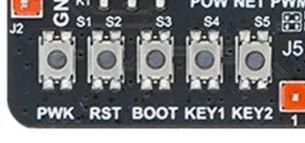
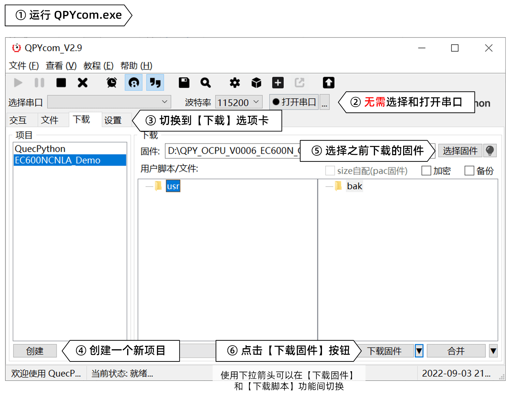
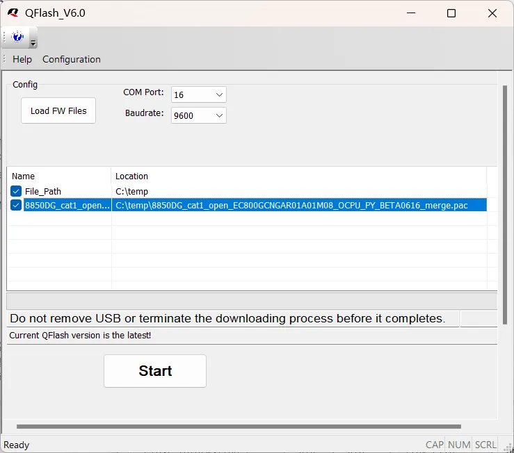

在完成了开发环境搭建和固件选择等准备工作之后，我们终于来到了 QuecPython 开发旅程中最关键的一步：**固件烧录**。 这一步就像为您的移远通信模块安装操作系统，只有烧录了正确的固件，模块才能运行 QuecPython 程序，并发挥其强大的功能。

## 检查前期准备工作：确保万事俱备

在开始烧录之前，我们需要进行一系列检查，确保所有准备工作都已就绪，以避免烧录失败或其他意外情况。 请您仔细核对以下项目，并对未能达标的项目进行调整：

1.  **操作系统和安全软件**
    - 您是否正在使用 64 位 Windows 10 或 Windows 11 操作系统？ QuecPython 的烧录工具和驱动程序主要针对这两种操作系统设计，其他版本的操作系统可能会出现兼容性问题。
    - 您是否已经关闭了电脑上的防病毒软件？ 一些防病毒软件可能会将 QuecPython 的烧录工具误判为恶意软件，从而阻止其正常运行。
2.  **驱动程序**
    - 您是否已经按照 [工具下载和安装](../install_tools) 章节的要求，安装了与您的模块型号匹配的 USB 驱动程序？ 驱动程序可以让您的电脑识别模块，并实现与模块的通信。
    - 如果您之前使用过其他品牌的模块或移远的 AT 指令开发方式，请确保您已经卸载了旧的驱动程序，并安装了适用于 QuecPython 开发的最新驱动程序，以避免驱动冲突。
3.  **开发板连接**
    - 您是否已经按照 [开发板上电和连接](https://aistudio.google.com/evb_boot) 章节的要求，对开发板进行了正确、合理的供电？ 模块的供电是否稳定可靠，直接影响到烧录过程的成功率。
    - 您是否能够在电脑端的设备管理器中识别到相应的串口？ 这是模块与电脑通信的桥梁，如果串口识别错误，烧录工具将无法与模块进行通信。
    - 您是否能够进行正常的 AT 指令交互？ 通过 AT 指令测试可以验证模块的基本功能是否正常，以及模块与电脑之间的通信是否畅通。
4.  **固件**
    - 您是否已经按照 [固件选择](https://aistudio.google.com/choose_fw) 章节的要求，选择了与模块型号**完全一致**的固件？ 烧录错误的固件可能会导致模块无法正常工作，甚至可能损坏模块硬件。
    - 您是否已经将固件压缩包解压到您的电脑上？ 烧录工具需要读取解压后的固件文件，而不是网站下载的原始压缩包文件。
    - 您是否已经找到了正确的固件文件？ 有些固件压缩包中可能包含多个文件，您需要根据芯片平台和固件类型选择正确的固件文件。

## 进入下载模式：开启模块的“刷机”模式

在烧录固件之前，我们需要先让模块进入下载模式。 下载模式，类似于我们熟悉的手机的 Recovery 模式或 Fastboot 模式，是模块的一种特殊运行模式，专用于烧录固件。在下载模式下，模块的正常操作系统不会运行，而是等待接收来自电脑的固件数据。

模块通常可以通过两种方式进入下载模式：

1.  **通过 AT 指令触发**: 如果模块能够正常开机并响应 AT 指令，您可以通过 AT 交互串口发送 `AT+QDOWNLOAD=1` 指令，使模块进入下载模式。QPYcom 和 QFlash 等烧录工具通常会自动使用此方法，将正在运行的模块切换到下载模式，所以**对于大部分用户而言，无需手动执行此操作**。
2.  **通过硬件电平触发**: 所有模块都支持通过硬件电平触发的方式进入下载模式。模块在上电开机时，会检测一个特定引脚 (USB_BOOT 引脚) 的电平。如果该引脚的电平符合预设条件（例如，被拉低或拉高），则模块会直接进入下载模式，而不会启动正常的操作系统。这种方式不依赖于模块的软件状态，即使模块的操作系统崩溃，也能够通过此方法进入下载模式，因此常被称为“救砖”模式。



移芯平台 (EC600E、EC800E 等) 的产品**只能**通过硬件电平触发的方式进入下载模式。其他平台的模块则同时支持两种方式。



尽管 QPYcom 和 QFlash 等烧录工具可以自动控制模块进入下载模式，但了解手动触发下载模式的方法仍然十分重要，因为它可以帮助您：

- **烧录移芯平台模块**: 如上文所述，移芯平台的模块只能通过硬件触发的方式进入下载模式，因此您需要掌握手动触发的方法才能烧录这些模块的固件。
- **提高烧录成功率**: 如果使用自动触发下载模式的方式屡次失败，您可以尝试手动触发下载模式，这有时可以提高烧录的成功率。
- **修复模块故障**: 如果模块的软件运行出错，或者操作系统崩溃，无法正常响应 AT 指令，您可以通过手动触发下载模式来“救砖”，重新烧录固件以修复模块。

以下列举了一些常见开发板进入下载模式的操作方法：

- **EC600X_QuecPython_EVB 开发板**: 请在长按 **PWK 按键** 开机前，先按住 **BOOT 按键**，等开机后再松开 BOOT 按键。
- **EC800E 双排针核心板**: 请在上电前将 **IO19** 引脚与 **GND** 引脚相连接，然后上电，待模块进入下载模式后再断开 IO19 和 GND 之间的连接。
- **自行设计制作的电路板**: 请参考相应型号的《硬件设计手册》中的 **USB_BOOT** 这一章节进行操作。



**注意**

- 进入下载模式后，在电脑端的设备管理器中，您应该能够看到名为 `Quectel QDloader Port` 的串口 (不同型号的模块，下载串口的名称可能会有所不同)。如果设备管理器中仍然显示 `Quectel USB AT Port`，说明未能成功进入下载模式，请断电后重试。

| 模块型号                                                          | 下载串口名称          |
| ----------------------------------------------------------------- | --------------------- |
| EC600N EC800N EC600M EC800M EG810M EC600K EC800K EG800K | Quectel Download Port |
| EC200U EC600U EC600G EC800G                                  | SPRD U2S Port         |
| EC600E EC800E                                                     | Quectel QDLoader Port |

- 部分模块会在进入下载模式后不久自动重启并进入普通模式。因此，当模块进入下载模式后，请在 **10 秒内开始固件烧录**。



## 烧录固件：将 QuecPython 注入模块

成功进入下载模式后，就可以开始烧录固件了。您可以使用 QPYcom 或 QFlash 工具进行烧录，两种工具各有特点，您可以根据自己的喜好选择。

### 使用 QPYcom 烧录固件

QPYcom 是移远官方推出的 QuecPython 集成开发工具，它提供了图形化界面，可以方便地进行固件烧录。具体步骤如下：

1.  打开 QPYcom 工具，切换到 **下载** 选项卡。
2.  点击左下角的 **创建** 按钮，创建新项目。
3.  在左侧栏中，选中刚刚创建的项目。
4.  点击右侧 **选择固件** 按钮，选中之前解压出的固件。
5.  点击右下角 **下载脚本** 旁边的 **▼**，切换到 **下载固件** 模式。
6.  点击 **下载固件** 按钮，等待底部进度条跑满并弹出成功提示。
7.  断开开发板与电脑端的连接和供电，然后重新对其上电并再次连接至电脑。



**警告**

为了避免设备变砖，在出现烧录成功或失败的提示之前：

- **严禁关闭 QPYcom 程序！**
- **严禁断开模块与电脑之间的连接！**
- **严禁断开模块的供电！**



### 使用 QFlash 烧录固件

QFlash 工具是移远提供的另一种固件烧录工具，它提供了更加底层的控制功能，适用于一些特殊情况，例如修复模块故障或烧录定制固件。

1. 以管理员身份运行 QFlash 程序。
2. 点击 **COM Port** 右侧的下拉列表，选择固件烧录串口所对应的串口号（可打开设备管理器确认）。无需指定波特率。
3. 点击 **Load FW Files** 按钮，选中模块的 QuecPython 固件（`.pac` / `.zip` / `.binpkg` 格式文件）。QFlash 工具会自动对固件进行解析并做好烧录准备。
4. 当 QFlash 工具的信息栏中没有错误提示，同时 **Start** 按钮变为黑色时，说明可以进行烧录。点击 **Start** 按钮，稍等片刻，进度条将开始滚动。
5. 待进度条跑满，同时出现 **PASS** 字样时，说明固件烧录成功。
6. **关闭 QFlash 软件**。
7. 断开开发板与电脑端的连接和供电，然后重新对其上电并再次连接至电脑。



**警告**

为了避免设备变砖，在出现烧录成功或失败的提示之前：

- **严禁关闭 QFlash 程序！**
- **严禁断开模块与电脑之间的连接！**
- **严禁断开模块的供电！**





**注意**

1. 在开始烧录之前，请再次确认 QFlash 工具和 QuecPython 固件两者均位于不包含中文、空格和其他特殊字符的路径下。部分用户仅将固件复制到英文路径下，但 QFlash 所在的路径依旧包含中文或空格，同样会导致烧录失败。部分用户自行打包或从第三方渠道获取的固件的文件名中可能包含了中文、空格或其他特殊字符，请将其修改为纯英文的文件名。
2. QFlash 工具可能会控制正常运行的模块进入下载模式。因此，在固件烧录完成后，请及时关闭 QFlash 工具。



## 烧录失败？冷静排查，解决问题！

在固件烧录过程中，您可能会遇到一些问题，例如烧录失败、模块无法启动等。遇到这种情况时请不要慌张，您可以按照以下步骤进行排查：

1.  **检查前期准备工作**:
    - 仔细检查模块的 OC 信息，确保您选择的固件与模块型号完全匹配。
    - 确认您已经正确安装了 USB 驱动程序，并且驱动程序与您的模块型号兼容。
    - 检查模块的供电是否正常，电压和电流是否符合模块的规格要求。
    - 确保模块已经正确进入下载模式。
2.  **更换数据线**: 尝试更换一根质量可靠的 USB 数据线。劣质数据线可能会导致数据传输错误，从而导致烧录失败。
3.  **更换 USB 接口**: 尝试将模块连接到电脑上的其他 USB 3.0 接口，尤其是主机后置的 USB 3.0 接口。有些 USB 接口可能供电不足或存在兼容性问题，导致烧录失败。
4.  **重新上电**: 尝试断开模块的电源，然后重新上电，并再次尝试烧录。
5.  **重启电脑**: 尝试重启您的电脑，然后再次尝试烧录。
6.  **更换电脑**: 如果以上方法都无法解决问题，您可以尝试更换一台电脑进行烧录。

如果以上方法都无法解决问题，请联系移远通信的技术支持团队寻求帮助。

## 总结

固件烧录是 QuecPython 开发的第一步，也是至关重要的一步。通过本文，您应该已经了解了如何使模块进入下载模式，以及如何使用 QPYcom 和 QFlash 工具进行固件烧录。希望这份指南能够帮助您顺利完成固件烧录，为您的 QuecPython 开发之旅奠定坚实的基础。

在下一篇文章中，我们将向您介绍一些入门阶段的基本操作和常用资源，希望为您的新手上路提供必要的帮助。
