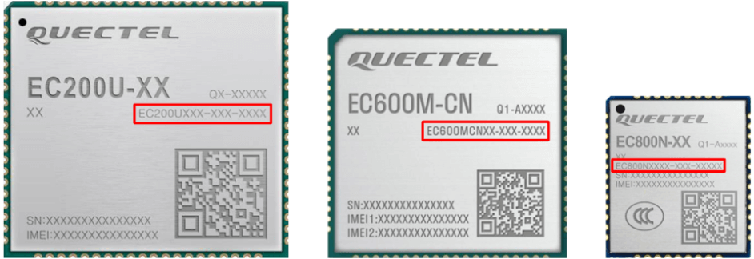
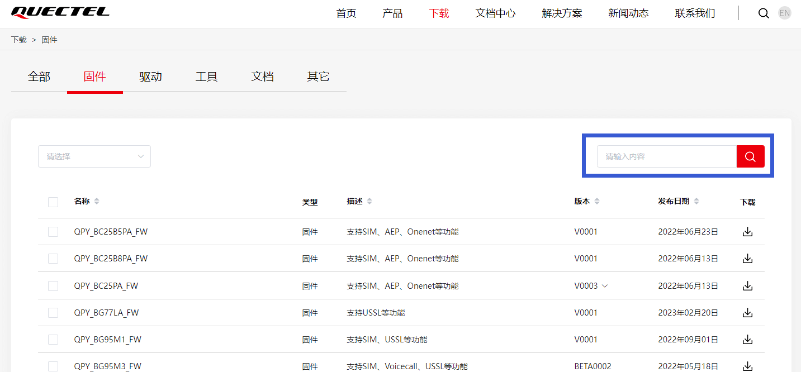
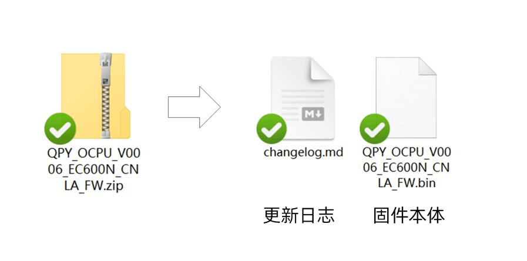
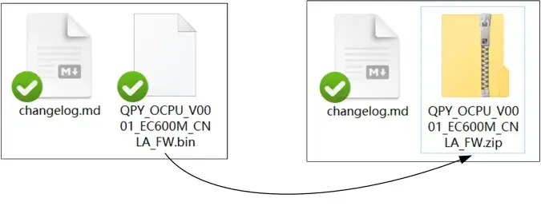

在开始激动人心的 QuecPython 开发之旅之前，我们需要为您的移远通信模块选择并烧录合适的固件。固件，可以理解为模块的“操作系统”，它提供了模块运行 QuecPython 程序所需的环境和功能。就像手机需要安装 Android 或 iOS 操作系统才能正常工作一样，不同的移远模块需要烧录与之匹配的 QuecPython 固件才能运行您的 Python 代码。

选择正确的固件至关重要，它关系到模块能否正常工作，甚至可能影响到模块的硬件安全。烧录不匹配的固件可能导致模块功能异常，甚至可能造成永久性损坏。 本文将作为您的领航员，引导您完成 QuecPython 固件的选择和准备工作，为您的开发之旅奠定坚实的基础。

## 为什么要烧录 QuecPython 固件？

移远通信模块出厂时通常预装了标准的 AT 固件，您可以通过 AT 指令控制模块的基本功能，例如发送短信、拨打电话等。然而，AT 指令的功能相对有限，难以满足复杂的物联网应用需求。

QuecPython 固件则为模块提供了更加强大和灵活的开发方式。它基于 MicroPython —— 一种专为嵌入式设备设计的精简高效的 Python 解释器，允许您直接在模块上运行 Python 代码，实现更加复杂的控制逻辑和数据处理。

通过烧录 QuecPython 固件，您可以：

- **使用 Python 语言开发**: Python 语言语法简洁易懂，拥有丰富的第三方库，可以大大降低开发难度，提高开发效率。
- **直接控制模块硬件**: QuecPython 提供了丰富的 API，可以方便地控制模块的各种硬件资源，例如 GPIO、UART、I2C、SPI 等。
- **实现网络通信**: QuecPython 支持多种网络协议，例如 TCP/IP、HTTP、MQTT 等，可以方便地实现模块与云平台、服务器或其他设备之间的通信。
- **构建复杂的应用**: QuecPython 支持多任务、多线程、事件驱动等编程模式，可以帮助您构建更加复杂的物联网应用。

## 确认模块型号：精准匹配，避免风险

在选择和下载固件之前，首先要明确一点：移远模块的型号并不仅仅是 EC800M 这样简单的标识。每个移远模块都有一个唯一的标识符，称为订购代码 (Ordering Code, OC)，用于标识模块的具体型号和功能。例如，`EC800MCNGA-I05-SGNSA` 就是一个完整的 OC，它包含了多个部分，代表着模块的系列、封装、区域、功能和版本等信息。

**对于 QuecPython 用户而言，您只需要关注 OC 的第一部分**，例如 `EC800MCNGA`。这部分信息包含了模块系列和子型号信息，是选择正确固件的关键。仅仅知道模块系列，例如 EC800M，是不足以确定固件版本的。

以 EC600N 为例，它仅仅代表一个模块系列，包含了多个子型号。`EC600NCNLA-N05-SNNSA` 和 `EC600NCNLF-N06-SNNDA` 都属于 EC600N 系列，但它们是两个不同的子型号，需要使用不同的固件。`EC600NCNLA-N05-SNNSA` 模块可以刷入 `QPY_OCPU_V0006_EC600N_CNLA_FW` 固件，但在刷入型号与之不符的 `QPY_OCPU_V0001_EC600N_CNLF_FW` 固件时会报错。再例如，`EC200UCNAA-N05-SGNSA` 模块可以刷入 `QPY_OCPU_V0001_EC200U_CNAA_FW` 固件，但在刷入型号与之不符的 `QPY_OCPU_V0001_EC200U_CNLA_FW` 固件时不会报错，但模块的部分功能会不正常。

因此，在下载固件前，**务必确认模块的具体型号 (OC)**，并确保您选择的固件与模块型号完全匹配。

您可以在模块表面金属屏蔽罩上找到模块的 OC 信息，如下图所示。





**提示**

请仔细核对并牢记 OC 信息，确保您之后选择的固件与模块型号完全匹配。



## 获取固件：从官方渠道下载

您可以在 QuecPython 官网的 [下载页面](https://python.quectel.com/download) 上找到适用于不同型号模块的 QuecPython 固件。为了方便您查找，官网下载页面提供了以下两种方式：

- **下拉菜单**: 您可以使用页面左上角的下拉菜单，根据模块系列和功能代码快速筛选出可用的固件。例如，如果您需要查找 EC800M 系列模块的固件，您可以在下拉菜单中选择 **EC800M-CN** ，然后根据功能代码选择相应的固件。
- **搜索框**: 您也可以使用页面右上角的搜索框，输入模块型号或固件名称进行搜索。例如，如果您需要查找 EC800MCNGA 模块的固件，您可以在搜索框中输入 `EC800M` 或 `EC800M_CNGA` 进行搜索。





**提示**

- 固件名称通常遵循 `QPY_OCPU_模块系列_子型号_FW` 的格式。例如，对于 `EC800MCNGA-I05-SGNSA` 模块，其对应的固件名称为 `QPY_OCPU_EC800M_CNGA_FW`。
- 如果您在网页上搜索到多款固件，请优先选择名称格式符合 `QPY_OCPU_模块系列_子型号_FW` 的固件。
- 如果您无法判断找到的固件是否适用于您的设备，请及时联系官方技术人员咨询，避免盲目操作，造成模块损坏。





**共用固件情况**

在某些情况下，不同子型号的模块可以使用同一个 QuecPython 固件。这是因为这些子型号的硬件配置和功能基本相同，只是在某些细节参数上有所差异，例如射频参数、网络频段等。

以下表格列出了一些可以使用共用固件的模块型号：

| 模块 OC                                                                    | 固件名称                |
| -------------------------------------------------------------------------- | ----------------------- |
| EC600MCNLA<br />EC600MCNLE                                                 | QPY_OCPU_EC600M_CNLE_FW |
| EC800MCNLA<br />EC800MCNLE                                                 | QPY_OCPU_EC800M_CNLE_FW |
| EC600MCNLC<br />EC600MCNLF                                                 | QPY_OCPU_EC600M_CNLF_FW |
| EC800MCNLC<br />EC800MCNLF                                                 | QPY_OCPU_EC800M_CNLF_FW |
| EC800MCNGC<br />EC800MCNGD                                                 | QPY_OCPU_EC800M_CNGD_FW |
| EC600ECNLC<br />EC600ECNLE<br />EC600ECNLQ<br />EC600ECNLD<br />EC600ECNCG | QPY_OCPU_EC600E_CNLC_FW |
| EC800ECNLC<br />EC800ECNLE<br />EC800ECNLQ<br />EC800ECNLD<br />EC800ECNCG | QPY_OCPU_EC800E_CNLC_FW |

如果在官网上没有找到与您模块型号完全匹配的固件，请检查是否存在以上共用固件的情况。



在找到所需的固件后，直接点击行尾的下载图标，即可开始下载。



**警告**

在下载和烧录固件前，请务必检查模块的 OC 信息，**确认固件与模块型号相一致**。 由于内部器件和参数的差异，同一系列模块的不同子型号（OC）之间，它们的 QuecPython 固件**通常互不兼容**。烧录不匹配的固件可能导致器件损坏和其他损失。



## 解压固件：准备烧录

从官网下载到的通常是一个压缩包文件 (`.zip` 格式)。在烧录固件之前，您需要先将压缩包解压到您的电脑上。这是因为压缩包内除了需要烧录的固件外，还包含着 Changelog 等一些文件。只有解压后的、正确的固件文件才能被固件烧录工具识别。



您还可能从第三方网站、QQ 群或技术支持人员等渠道获得固件。不同来源、不同类型的固件，解压后得到的文件类型会存在差异。这主要是由于固件编译和后续处理时的不同步骤导致的。

为了帮助您选择正确的固件文件，本节将以不同芯片平台（芯片厂商）的产品为例，详细讲解如何解压固件并选取正确的文件。

### 翱捷（ASR）Cat.1 平台固件



适用范围：EC100Y / EC600S / EC600N / EC800N / EC600M / EC800M / EG810M / EC600K / EC800K / EG800K / EG800P 等



#### 临时版固件

您可能会从技术支持人员手中获取到临时编译的临时版固件。这些固件通常是为了满足一些新功能、定制功能或临时性的缺陷修复的需求而提供的，它们可能没有经过完整的测试和验证，因此稳定性可能不如公开版固件。QuecPython 固件通常使用 Helios SDK 编译。该 SDK 不对普通用户公开，但有一定体量的商业客户（大客户）可以申请获取。

官方技术人员可能会向您提供可直接烧录的固件，也可能提供的是打包好的、包含有固件的编译成果。

##### 可直接烧录的 .zip 固件

以下是一个可直接烧录的 `.zip` 固件文件的结构示例：

```
EC800KCNCCR07A01M02_OCPY_QPY_BETA1202.zip
├── bootloader.ubi
├── cp.bin
├── customer_app.bin
├── customer_fs.bin
├── download.json
├── dsp.bin
├── firmware.bin
├── flasher.img
├── flashinfo.bin
├── fota.json
├── partition.bin
├── preboot.img
├── ReliableData.bin
├── rf.bin
└── system.img
```

**烧录方法**: 您可以直接使用 QPYcom 或 QFlash 工具烧录此 `.zip` 文件。

##### 打包后的编译结果

以下是一个打包后的临时版固件压缩包的结构示例，其中包含了可直接烧录的 `.zip` 固件文件：

```
EC800KCNCCR07A01M02_OCPY_QPY_BETA1202.zip
├── Quectel_Disclaimer_for_Software_BETA_Version.pdf
└── EC800KCNCCR07A01M02_OCPY_QPY_BETA1202
    ├── DBG
    │   ├── CRANE_DS_XIP_DM_GENERIC.axf
    │   ├── CRANE_DS_XIP_DM_GENERIC.map
    │   ├── CRANE_DS_XIP_DM_GENERIC_DIAG.mdb
    │   ├── CRANE_DS_XIP_DM_GENERIC_MDB.txt
    │   ├── CRANE_DS_XIP_DM_GENERIC_NVM.mdb
    │   ├── customer_app.elf
    │   ├── customer_app.hex
    │   └── customer_app.map
    ├── EC800KCNCCR07A01M02_OCPY_QPY_BETA1202.json
    ├── EC800KCNCCR07A01M02_OCPY_QPY_BETA1202.zip  <-- 这是我们要烧录的固件
    └── EC800KCNCCR07A01M02_OCPY_QPY_BETA1202_release_pack.zip
```

**注意**: 两种形式的临时版固件文件名可能相同（例如，上图中实际要烧录的固件和提供给用户的打包好的编译结果都是命名为 `EC800KCNCCR07A01M02_OCPY_QPY_BETA1202.zip`）。为了避免混淆，建议您解压所有 .zip 文件，并检查其内容，以确定哪个是可直接烧录的固件。

#### 公开版固件

当临时版固件经过充分测试和验证后，官方人员会将其发布为公开版固件。公开版固件的制作流程如下：

1. **重命名**: 将临时版固件的名称修改为 `QPY_OCPU_模块系列_子型号_FW` 的格式。例如，将 `EC800KCNCCR07A01M02_OCPY_QPY_BETA1202.zip` 重命名为 `QPY_OCPU_BETA0001_EC800K_CNCC_FW.zip`。
2. **修改后缀**: 将固件文件的后缀名从 `.zip` 修改为 `.bin`。
3. **重新打包**: 将 `.bin` 固件文件与 `changelog.md` 和免责声明等文件一起重新打包成一个 `.zip` 压缩包，并使用与固件文件相同的名称。

最终得到的公开版固件压缩包结构如下：

```
QPY_OCPU_BETA0002_EC800K_CNLC_FW.zip
└── QPY_OCPU_BETA0002_EC800K_CNLC_FW
    ├── changelog.md
    ├── QPY_OCPU_BETA0002_EC800K_CNLC_FW.bin  <-- 这是我们要烧录的固件
    └── Quectel_Disclaimer_for_Software_BETA_Version.pdf
```

从 QuecPython 官方网站获取到的 ASR Cat.1 平台的固件基本上都采用了这种打包格式。您在下载后，需要对下载到的 `.zip` 文件进行解压。

**烧录方法:**

- **QPYcom 工具**: 直接选择解压后的 `.bin` 文件进行烧录。
- **QFlash 工具**: 请您将 `.bin` 文件拷贝到一个**不包含中文、空格和其他特殊字符**的路径下（如 D 盘根目录），然后将文件后缀由 `.bin` 改回 `.zip`，再在 QFlash 中加载该 `.zip` 文件。否则 QFlash 可能无法正常识别固件。



### 紫光展锐（Unisoc）Cat.1 平台固件



适用范围：EC200U / EC600U / EC600G / EC800G 等



#### 临时版固件

展锐 Cat.1 平台的临时版固件与 ASR 平台类似，在编译时也会生成两个同名的 `.pac` 文件和一个 `_merge.pac` 文件。`_merge.pac` 文件是我们要烧录的 QuecPython 固件本体，可以使用 QPYcom 或 QFlash 工具进行烧录。

以下是一个临时版固件压缩包的结构示例：

```
EC600UCNLBR03A01M08_BT_OCPU_QPY_BETA1107.zip
├── Quectel_Disclaimer_for_Software_BETA_Version.pdf
└── EC600UCNLBR03A01M08_BT_OCPU_QPY_BETA1107
    ├── app
    │   ├── customer_app.elf
    │   ├── EC600UCNLBR03A01M08_BT_OCPU_QPY_BETA1107.elf
    │   ├── EC600UCNLBR03A01M08_BT_OCPU_QPY_BETA1107.img
    │   ├── EC600UCNLBR03A01M08_BT_OCPU_QPY_BETA1107.map
    │   ├── EC600UCNLBR03A01M08_BT_OCPU_QPY_BETA1107.pac
    │   ├── EC600UCNLBR03A01M08_BT_OCPU_QPY_BETA1107_flash_delete.pac
    │   └── EC600UCNLBR03A01M08_BT_OCPU_QPY_BETA1107_pyfs_erase.pac
    ├── 8915DM_cat1_open.elf
    ├── 8915DM_cat1_open.map
    ├── 8915DM_cat1_open_EC600UCNLBR03A01M08_BT_OCPU_QPY_BETA1107.pac
    └── 8915DM_cat1_open_EC600UCNLBR03A01M08_BT_OCPU_QPY_BETA1107_merge.pac  <-- 这是我们要烧录的固件
```

#### 公开版固件

展锐 Cat.1 平台的公开版固件有两种打包方式：

##### 旧版打包方式

1. 将 `.pac` 固件文件的名称修改为 `QPY_OCPU_模块系列_子型号_FW` 的格式。
2. 将 `.pac` 文件与 `changelog.md` 和免责声明等文件一起打包成一个 `.zip` 压缩包。

文件结构示例：

```
QPY_OCPU_BETA0004_EC600U_CNLB_FW.zip
└── QPY_OCPU_BETA0004_EC600U_CNLB_FW
    ├── changelog.md
    ├── QPY_OCPU_BETA0004_EC600U_CNLB_FW.pac  <-- 这是我们要烧录的固件
    └── Quectel_Disclaimer_for_Software_BETA_Version.pdf
```

**烧录方法**: 解压 `.zip` 文件，使用 QPYcom 或 QFlash 工具烧录其中的 `.pac` 文件。

##### 新版打包方式

从 2024 年 5 月开始，展锐 Cat.1 平台的公开版固件采用了新的打包方式。

1. 将 `.pac` 固件文件的名称修改为 `QPY_OCPU_模块系列_子型号_FW` 的格式。
2. 将 `.pac` 固件文件与 `platform_config.json` 文件（用于帮助 QPYcom 工具识别平台类型）一起打包成一个 `.zip` 文件。
3. 将 `.zip` 文件的后缀名修改为 `.bin`。
4. 将 `.bin` 文件与 `changelog.md` 和免责声明等文件一起打包成一个 `.zip` 压缩包。

这种打包方式是为了方便用户使用 QPYcom 工具进行烧录，同时也兼容 QFlash 工具。

文件结构示例：

```
QPY_OCPU_BETA0001_EC600U_CNLC_FW.zip
└── QPY_OCPU_BETA0001_EC600U_CNLC_FW
    ├── changelog.md
    ├── Quectel_Disclaimer_for_Software_BETA_Version.pdf
    └── QPY_OCPU_BETA0001_EC600U_CNLC_FW.bin   <-- 使用 QPYcom 工具烧录时选择此文件
        ├── platform_config.json
        └── QPY_OCPU_BETA0001_EC600U_CNLC_FW.pac   <-- 使用 QFlash 工具烧录时选择此文件
```

**烧录方法**:

- **QPYcom 工具**: 直接选择 `.bin` 文件进行烧录。
- **QFlash 工具**:
  1.  将 `.bin` 文件的后缀名改为 `.zip`。
  2.  将 `.zip` 文件解压到一个 **不包含中文、空格和其他特殊字符** 的路径下（如 D 盘根目录），获得其中的 `.pac` 文件。
  3.  在 QFlash 中选择该 `.pac` 文件进行烧录。

### 移芯（Eigencomm）Cat.1 平台固件



适用范围：EC600E / EC800E 等



#### 临时版 / 公开版（旧版）固件

与 ASR 和展锐平台不同，移芯平台的固件在编译完成后，生成的文件较多，易于混淆。固件压缩包结构如下图所示。

```
QPY_BETA0003_EC800E_CNLC_FW.zip
├── Quectel_Disclaimer_for_Software_BETA_Version.pdf
├── changelog.md
└── QPY_BETA0003_EC800E_CNLC_FW
    ├── agentboot_uart
    │   └── agentboot.bin
    ├── agentboot_usb
    │   └── agentboot.bin
    ├── ap_application.bin
    ├── ap_updater.bin
    ├── at_command.binpkg  <-- 这是我们要烧录的固件
    ├── customer_backup_fs.bin
    ├── customer_fs.bin
    ├── format_ec618.json
    ├── MergeRfTable.bin
    ├── quec_download_config.ini
    ├── quec_download_uart.ini
    └── quec_download_usb.ini
```

从 QuecPython 官方网站或第三方渠道获取到的移芯平台的固件基本上都采用了这种打包格式。您在下载后，需要对下载到的 `.zip` 文件进行解压，选取其中的 `at_command.binpkg` 文件进行烧录。您可以根据需要，采用 QPYcom 或 QFlash 工具完成烧录。

#### 公开版（新版）固件

从 2024 年 5 月开始，移芯 Cat.1 平台开始采用新的打包方式，与展锐平台的新版固件打包方式类似。

文件结构：

```
QPY_OCPU_V0003_EC800E_CNLC_FW.zip
└── QPY_OCPU_V0003_EC800E_CNLC_FW
    ├── changelog.md
    └── QPY_OCPU_V0003_EC800E_CNLC_FW.bin  <-- 使用 QPYcom 工具烧录时选择此文件
        ├── platform_config.json
        └── QPY_OCPU_V0003_EC800E_CNLC_FW
            ├── agentboot_uart
            │   └── agentboot.bin
            ├── agentboot_usb
            │   └── agentboot.bin
            ├── single_pkg
            │   ├── ap_at_command.bin
            │   └── cp-demo-flash.bin
            ├── allpkg_qdownload_image.bin
            ├── apcp_app_qdownload_image.bin
            ├── apcp_qdownload_image.bin
            ├── ap_application.bin
            ├── ap_updater.bin
            ├── at_command.binpkg  <-- 使用 QFlash 工具烧录时选择此文件
            ├── customer_backup_fs.bin
            ├── customer_fs.bin
            ├── format_ec618.json
            ├── MergeRfTable.bin
            ├── quec_download_config.ini
            ├── quec_download_uart.ini
            ├── quec_download_usb.ini
            └── quec_usb_prog_pkg.bin
```

**烧录方法**:

- **QPYcom 工具**: 直接选择 `.bin` 文件进行烧录。
- **QFlash 工具**:
  1.  将 `.bin` 文件的后缀名改为 `.zip`。
  2.  将 `.zip` 文件解压到一个 **不包含中文、空格和其他特殊字符** 的路径下（如 D 盘根目录），获得其中的 `at_command.binpkg` 文件。
  3.  在 QFlash 中选择该 `at_command.binpkg` 文件进行烧录。

## 总结

通过本文，您应该已经了解了如何确认模块型号、选择合适的 QuecPython 固件，以及一些常见的注意事项。在完成固件选择和解压后，您就可以开始进行固件烧录了，相关步骤请参考后续文章。
