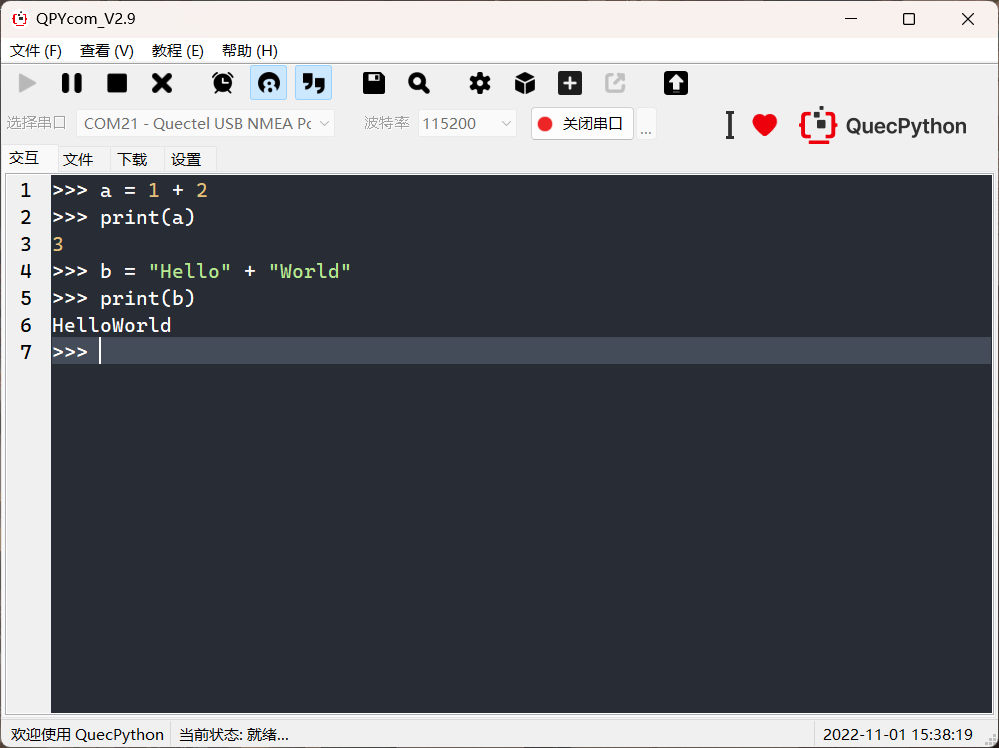

恭喜您！ 历经千辛万苦，您终于完成了固件烧录，成功地为您的移远通信模块注入了 QuecPython 的灵魂。现在，让我们一起开启激动人心的 QuecPython 开发之旅，探索模块的无限潜能，构建您的物联网应用！

## 打好基础：入门学习和背景知识

在正式开始 QuecPython 开发之前，建议您先了解一些基础知识，这将有助于您更快地理解和掌握 QuecPython 的开发流程和技巧。

- **QuecPython 入门学习路线**：对于首次接触 QuecPython 的用户，我们为您准备了 [入门学习路线](../../learning_path)， 它规划了完整、实用、清晰的学习流程，可以帮助您对 QuecPython 及后续的学习内容有一个初步的了解。 这份路线图将引导您逐步学习 QuecPython 的语法、API、开发工具等内容，并通过实际案例帮助您巩固所学知识。

- **物联网和蜂窝通信模块基础**：如果您是物联网和蜂窝通信模块开发的新手，我们也为您准备了 [背景知识](../../knowledge) 章节，使用轻松、易懂的语言介绍了从物联网架构到 Python 特性的各方面知识，帮助您在短时间内对这个行业有一个较为全面的认知。 这部分内容将涵盖物联网的基本概念、架构和应用场景，以及蜂窝通信技术的基本原理和发展历程，帮助您建立对物联网和蜂窝通信的整体理解。

## REPL 交互：与模块对话，探索无限可能

REPL (Read-Eval-Print Loop)，中文译为“读取-求值-输出”循环，是一种简单的交互式编程环境。它允许您实时输入代码，并立即查看执行结果，方便进行代码调试和功能验证，是学习和探索 QuecPython 的强大工具。

### REPL 工作原理

REPL 环境提供了一个命令行界面 (CLI)，类似于 Windows 的命令提示符 (CMD) 或 macOS / Linux 的 Shell。 您可以在 CLI 中输入一行或多行 Python 代码，REPL 环境会读取您的输入，对其进行解析和执行，并将执行结果输出到屏幕上。这个过程会循环进行，直到您退出 REPL 环境。

### QuecPython 的 REPL 串口

烧录有 QuecPython 固件的移远通信模块，通常会提供一个 USB 虚拟串口作为 REPL 串口，用于与上位机工具连接、用户交互、脚本调试和文件传输。模块连接到电脑后，会虚拟出多个串口，每个串口都有不同的功能。 其中，用于 REPL 交互的串口通常以 `Quectel USB REPL Port` 或 `Quectel USB MI05 COM Port` 命名，但具体的串口名称可能会因模块型号和 USB 驱动程序版本而有所差异。

以下表格列出了一些常见模块型号及其对应的 REPL 串口名称：

| 模块型号                  | 可能的 REPL 串口名称                                                                             |
| ------------------------- | ------------------------------------------------------------------------------------------------ |
| EC600S<br />EC600N EC800N | Quectel USB MI05 COM Port<br />USB 串行设备                                                      |
| EC600M EC800M<br />EG810M | Quectel USB REPL Port<br />Quectel USB MI05 COM Port<br />Quectel Modem Device<br />USB 串行设备 |
| EC200U EC600U             | Quectel USB REPL Port<br />Quectel USB Serial-1 Port<br />Quectel USB NMEA Port                  |
| EC600G EC800G             | Quectel USB REPL Port<br />Quectel USB NMEA Port                                                 |
| EC600E EC800E             | USB 串行设备                                                                                     |



**提示**

- 如果您不确定哪个串口是 REPL 串口，可以尝试连接不同的串口，并按下回车键。如果模块返回 `>>>` 提示符，则说明您已经连接到了 REPL 串口。
- 若用户电脑的设备管理器中未出现上述名称的新串口，或新增串口出现在 **其他设备**、**未识别的设备** 等分类下，请首先确认 QuecPython 固件已经成功烧录，然后重新安装 QuecPython 官网提供的 USB 驱动程序，或在另一台电脑上尝试连接。



### 连接 REPL 串口

连接 REPL 串口需要使用串口调试工具。您可以使用任何支持终端模式的串口调试工具连接到 REPL 串口，例如：

- **PuTTY**: 一款免费、开源的串口调试工具，功能强大，支持多种协议和配置选项。您可以从 [PuTTY 官网](https://www.chiark.greenend.org.uk/~sgtatham/putty/latest.html) 下载 PuTTY。
- **MobaXterm**: 一款功能丰富的终端模拟器，集成了 SSH、Telnet、Rlogin、RDP、VNC、X11、串口等多种连接方式。您可以从 [MobaXterm 官网](https://mobaxterm.mobatek.net/) 下载 MobaXterm。
- **minicom**: 一款轻量级的串口调试工具，适用于 Linux 系统。您可以使用 Linux 系统的包管理器安装 minicom，例如在 Ubuntu 系统中，可以使用以下命令安装 minicom: `sudo apt install minicom`。

您也可以使用 QuecPython 官方提供的 QPYcom 工具连接到 REPL 串口。



**提示**

由于 REPL 串口是 USB 虚拟串口，连接时无需指定波特率。



### REPL 交互体验

连接成功后，您将在串口工具的终端窗口中看到 `>>>` 提示符，这表示模块已经准备好接收您的 Python 代码了。

您可以尝试输入一些简单的 Python 代码，例如：

```python
print("Hello, QuecPython!")
```

按下回车键后，模块会立即执行您的代码，并在终端窗口中输出 `Hello, QuecPython!`。





**注意**

- Python 语言对于代码的缩进格式十分敏感。在 REPL 串口中输入或粘贴多行代码时，很容易在没有感知的情况下破坏缩进格式，导致代码无法正常运行。因此，在大部分情况下，**不建议向 REPL 串口内直接输入多行代码**。
- 如需对多行代码进行调试，可将其保存为 `.py` 格式的脚本文件，并使用 QPYcom 或其他工具将其传输至模块中，然后再运行。



## QPYcom：您的 QuecPython 开发助手

QPYcom 是移远官方推出的 QuecPython 开发工具，它集成了 REPL 串口交互、脚本文件下载、量产固件合成等多种功能，可以帮助您更方便地进行 QuecPython 开发。

### QPYcom 主要功能

QPYcom 的主要功能包括：

- **REPL 交互**: QPYcom 内置了串口终端，您可以使用它连接到模块的 REPL 串口，进行交互式编程和调试。
- **脚本文件管理**: 您可以使用 QPYcom 将 Python 脚本文件上传到模块的内部存储器中，并管理模块中的文件和文件夹。
- **固件烧录**: QPYcom 可以帮助您烧录 QuecPython 固件到模块中，无需使用其他烧录工具。
- **量产固件合成**: QPYcom 可以帮助您将 Python 脚本文件和其它资源文件打包成一个固件文件，方便进行批量生产和部署。

### 学习 QPYcom

建议您通过 QuecPython [文档中心](https://python.quectel.com/doc/Application_guide/zh/dev-tools/QPYcom/index.html) 学习 QPYcom 的使用方法，文档中心提供了详细的教程和示例，可以帮助您快速掌握 QPYcom 的各项功能。

## 其他学习资源：拓展您的 QuecPython 技能

除了 QPYcom 工具之外，还有很多其他的学习资源可以帮助您更好地学习和使用 QuecPython。例如：

- **[QuecPython 官方网站](https://python.quectel.com/)**: 您可以从官网下载最新的 QuecPython 固件、驱动程序、工具和文档。您还可以查阅模块的规格书、应用笔记、设计指南等资料。
- **[QuecPython API 参考手册](https://python.quectel.com/doc/API_reference/zh/)**: 您可以从 API 参考手册中查找 QuecPython 提供的各种功能模块和函数的用法。API 参考手册是您学习和使用 QuecPython 最重要的参考资料之一，建议您将其收藏到浏览器书签中，方便随时查阅。
- **[QuecPython 应用指导](https://python.quectel.com/doc/Application_guide/zh/)**: 您可以从应用指导中学习如何使用 QuecPython 实现各种功能，例如网络连接、数据传输、设备控制等。应用指导包含了丰富的示例代码和详细的解释，可以帮助您快速上手 QuecPython 开发。

## 总结

至此，您已经成功地搭建了 QuecPython 开发环境，并迈出了探索 QuecPython 世界的第一步。回顾这段旅程，您已经掌握了选择合适的模块、安装必要的驱动程序和工具、为模块上电并连接到电脑、选择和烧录正确的固件等一系列操作。您已经拥有了打开 QuecPython 世界大门的钥匙，可以开始使用简洁优雅的 Python 代码，赋予移远通信模块以生命，让它们成为您物联网应用的忠实伙伴。

前方的道路充满挑战，但也充满乐趣。带上您的好奇心和探索精神，拿起您的键盘和开发板，开启您的 QuecPython 开发之旅吧！
