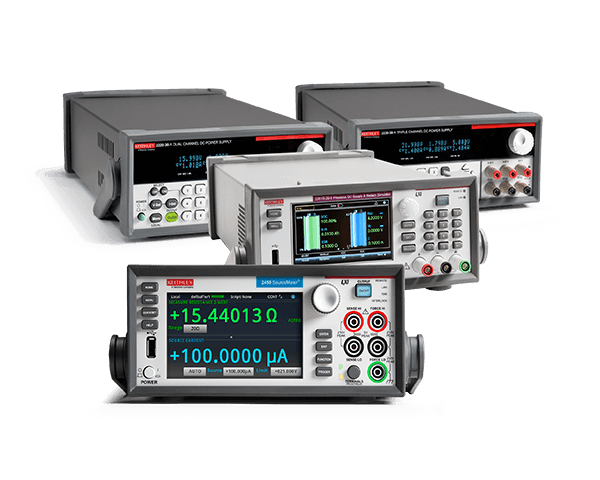
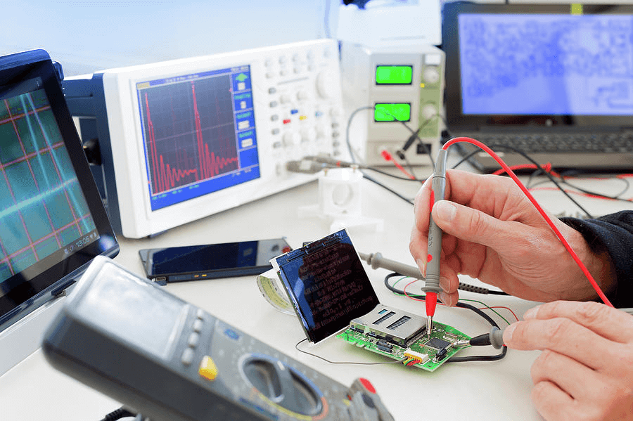

在踏上 QuecPython 模块二次开发的旅程之前，准备好必要的硬件设备是至关重要的。不同于传统的嵌入式开发，QuecPython 作为一种脚本语言开发方式，无需购买昂贵的调试器和仿真器。然而，为了确保开发过程的顺利进行，您仍然需要一些必备的硬件工具。本文将详细介绍 QuecPython 在固件烧录和后续开发过程中需要的硬件设备，并提供一些实用的建议，帮助您避免常见的陷阱，轻松开启 QuecPython 开发之旅。

## 个人电脑（上位机）: 您的开发基地

您的个人电脑将作为 QuecPython 开发的“基地”，用于编写代码、烧录固件、调试程序、与模块进行交互等操作。为了确保开发环境的稳定性和兼容性，请遵循以下建议：

### 操作系统

QuecPython 的固件烧录工具和驱动程序主要针对 Windows 操作系统设计。为了获得最佳的兼容性和稳定性，建议您使用以下操作系统：

- **Windows 10 (64 位)**: Windows 10 是目前最常用的 Windows 操作系统，QuecPython 的工具和驱动程序已经过充分测试，可以稳定运行。
- **Windows 11 (64 位)**: Windows 11 是 Windows 的最新版本，也能够良好地支持 QuecPython 开发环境。



**注意**

- **Windows 7 兼容性**: Windows 7 操作系统的生命周期已经于 2020 年初中止。QuecPython 的各类驱动和工具在 Windows 7 操作系统中可能存在兼容性问题，因此强烈不建议用户基于 Windows 7 操作系统进行 QuecPython 开发。
- **Linux 支持**: 除搭载紫光展锐芯片的 EC200U、EC600U 等模块外，其他模块均不支持在 Linux 操作系统中完成固件烧录。这是因为芯片厂商暂未提供针对 Linux 系统的 USB 驱动程序和固件烧录工具。
- **macOS 支持**: 芯片厂商未提供针对 macOS 操作系统的 USB 驱动程序和固件烧录工具。建议 macOS 用户更换 Windows 设备进行开发。
- **ARM64 架构**: 目前所有的驱动程序和开发工具均未对 ARM64 架构进行适配，不保证它们在 Windows on Arm 或树莓派等平台上的运行效果。如果您使用的是基于 ARM64 架构的电脑，建议您使用其他 x64 架构的设备进行开发。
- **虚拟机**: 请尽量避免在虚拟机（如 VMware Workstation、VirtualBox 等）中进行固件烧录和开发，以免发生错误和其他疑难情况。虚拟机的 USB 接口模拟可能会导致驱动程序无法正常识别模块，或者导致数据传输不稳定。



### 解压缩软件

QuecPython 的固件、驱动程序和工具通常以压缩包的形式提供。在开始操作之前，请确保您的电脑上已经安装了常用的解压缩软件，例如：

- **7-Zip**: 一款免费、开源的压缩软件，支持多种压缩格式，包括 .zip、.7z 等。
- **WinRAR**: 一款功能强大的压缩软件，支持多种压缩格式，并提供加密、分卷压缩等功能。

### 防病毒软件

建议您在进行固件烧录等操作之前，暂时**关闭**电脑上的防病毒软件，例如 360、卡巴斯基等。这是因为一些防病毒软件可能会将 QuecPython 的工具和驱动程序误判为恶意软件，从而阻止其正常运行。

## 数据线: 连接模块与电脑的桥梁

当前，大部分模块的固件烧录和 QuecPython 交互只能通过 USB 口完成。在开发前，请用户根据开发板实际引出的 USB 接口形式，准备质量可靠的 USB Type-C 或 Micro USB 数据线。

请注意:

- 劣质数据线可能导致固件烧录失败、供电不足、运行不稳定、器件损坏或其他异常情况，请尽量避免使用。建议选择知名品牌的数据线，或者经过质量认证的数据线。
- 为了避免单根数据线因为质量问题影响开发，建议首次接触 QuecPython 的用户准备三根以上的、来自不同厂商的数据线，以便在发生异常时替换。



**提示**

您可以通过以下方法判断数据线的质量：

- **观察外观**: 质量好的数据线通常外观整洁，线材柔软，接口牢固，没有明显的毛刺或缺陷。
- **检查线材**: 质量好的数据线通常采用较粗的线芯，并使用屏蔽层来减少信号干扰。
- **测试传输速度**: 可以使用 USB 测试软件测试数据线的传输速度，质量好的数据线传输速度应该比较稳定，不会出现明显的波动或掉速。



## 电源: 稳定可靠的能量来源

无线通信模块的功耗远高于传统单片机，在特定情况下可达到 10 W 甚至更高。为避免供电不足（尤其是在连接各种外设时）导致的功能异常和器件损坏，建议您使用最大输出功率不低于 10 W 的直流电源。

建议:

- 使用稳压电源，并确保其输出电压和电流符合模块的规格要求。您可以在模块的规格书中找到其供电要求。
- 在连接多个外设时，需要考虑总的功耗，并选择合适的电源。例如，如果您的应用需要连接一个功耗为 2 W 的传感器和一个功耗为 3 W 的电机，那么您需要选择一个输出功率至少为 15 W 的电源。



**警告**

- 切勿使用低于模块规格要求的电压或电流供电，否则可能会导致模块损坏。
- 请确保电源的正负极连接正确，否则可能会导致模块烧毁。



## 调试工具: 排查问题的利器

对于有自行设计和制作电路板，以及连接传感器、屏幕等外设的需求的用户，建议准备以下调试工具：

- **万用表**: 用于测量电压、电流、电阻等电路参数，帮助您检查电路连接是否正确，以及模块和外设的供电是否正常。例如，您可以使用万用表测量模块的供电电压是否符合规格要求，或者测量某个引脚的电平状态。
- **逻辑分析仪**: 用于捕获和分析数字信号，帮助您观察模块和外设之间的通信时序，以及排查通信错误。例如，您可以使用逻辑分析仪观察 UART 通信的数据波形，或者观察 I2C 通信的时序图。
- **示波器**: 用于观察和分析模拟信号，例如电源电压、音频信号等，帮助您排查电源问题和信号质量问题。例如，您可以使用示波器观察模块的电源电压是否稳定，或者观察音频信号的波形是否正常。



**提示**

- 选择合适的调试工具，并熟悉其使用方法。您可以在网上找到很多关于万用表、逻辑分析仪和示波器的使用教程。
- 在使用调试工具时，请注意安全操作规范，避免触电或损坏设备。例如，在测量电压时，请确保选择正确的量程，并避免探针接触到带电部件。



希望这份指南能够帮助您更好地了解 QuecPython 开发所需的硬件设备，开启您的物联网开发之旅！
