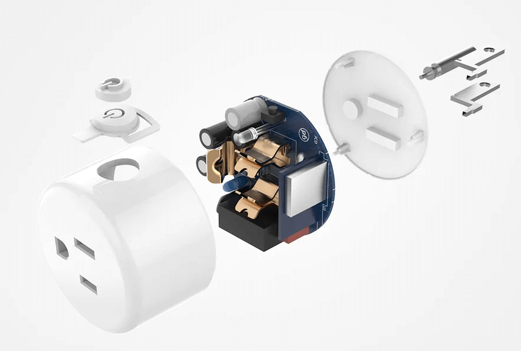

## 从互联网到物联网

20 世纪末，随着计算机网络和通信技术的兴起，互联网开始走进并融入人们的生活。传统互联网通常以人作为主体，数据的产生和传输都在人的控制下进行，数据的应用结果也在具体的人身上得到反映。以网络短视频为例，拍摄、上传和观看等环节都离不开用户的主动参与，而短视频平台对用户产生的数据进行分析和处理后，再根据偏好情况推送相关内容，最终受影响的依旧是用户本身。可以看出，传统互联网的大部分流程都是围绕人在运行和发展的。

随着技术的不断演进，物与物之间信息传输和交换的需求日趋增加，物联网（Internet of Things, IoT）的概念应运而生。

物联网是一个通过各种信息传感器、通信技术和计算机网络，将物理世界中的物体连接起来，实现信息交换和智能控制的网络。它利用各种信息传感器、射频识别技术、全球定位系统、红外线感应器、激光扫描器等各种装置与技术，实时采集任何需要监控、连接、互动的物体或过程，采集其声、光、热、电、力学、化学、生物、位置等各种需要的信息，通过各类可能的网络接入，实现物与物、物与人的泛在连接，实现对物品和过程的智能化感知、识别和管理。

现代物联网在本质上属于互联网的延伸。它将传统互联网的基础设施作为信息传递的载体，打破了时间和空间的限制，让“物”成为了数据产生和消费的主体，极大地拉近了“人与物”“物与物”的距离。以智慧农业灌溉为例，土壤中预埋的湿度传感器将土壤水分信息定时地上传到云端平台，当平台的程序监测到土壤缺水时，按照预设的规则，远程启动田间的灌溉设备，从而控制土壤含水量在合适水平。在这个场景中，无需人的参与，所有的流程都是靠物与物之间的交互完成，涉及的数据也是与“物”本身直接相关的。

当前，物联网的涵义和外延仍在不断的变化和发展中，因此还没有一个清晰准确的定义。不过，从上面的介绍中，可以大致看出物联网的特点：物联网是以“物”为主体的互联网，在形式和内容上处处体现着“物”的特征。因此，物联网应用的整体架构和开发方式也与传统的互联网应用有着显著的区别。

如今，物联网已经成为一种新型信息基础设施和社会经济发展模式。它在工业、农业、环境、交通、物流、安保等基础设施领域，在家居、医疗健康、教育、金融与服务业、旅游业等与生活息息相关的领域，都有着广泛的应用和创新，有效地推动了这些方面的智能化发展，使得有限的资源更加合理地使用分配，从而提高了行业效率，也大大地提高了人们的生活质量。

随着经济和科技的快速发展，20 多年前关于“万物互联”的幻想开始走入现实。从身边的各类智能设备、智能家居，到智慧地球和“元宇宙”的最新概念，物联网为这些技术变革提供了坚实有力的支撑。

## 物联网的体系结构

“下班前，打开手机中的开关，控制空调启动，到家后，即可享受舒适的室内温度。”这是日常生活中司空见惯的物联网应用场景。大部分物联网应用都和远程开空调一样，在用户层面的感知十分简单纯粹。但实际上，要实现这样一个简单的物联网应用，并不是一件容易的事。

一个完整的物联网应用，需要涉及到较多的技术、环节和角色。从数据流向和功能角度，物联网生态系统的体系结构可被大致分成四个层级。各层级执行属于自身的特定的功能，同时也通过各种渠道与其他层级之间进行互动，进而实现完整的物联网功能。

### 终端层

终端层（Terminal Layer），又称感知层（Perception Layer）或感知控制层，是物联网体系中最基础的一层。终端层的核心功能是与物理世界的交互，进而实现对现实对象（环境参数、设备状态等）的感知和对具体设备的控制。

终端层主要由各种传感器、执行器、标识设备等组成，负责采集、识别和控制物理世界的信息。传感器通过将现实世界的物理量转换为电信号，实现信息采集和识别的重要作用。实际的物联网设备中，除了传感器，通常还具备用于协调和控制所有功能和部件运行的主控和用于网络接入的通信模块等部件。

### 网络层

网络层（Network Layer）是负责将终端层的设备收集的数据传输到平台层，以及将平台层的控制指令发送回终端层的双向通信的桥梁。从功能维度，网络层又可分为接入层（Access Layer）和传输层（Transport Layer）。

接入层的功能涵盖 OSI 模型（开放系统互联模型，一种用于描述网络通信的七层模型）的物理层、数据链路层和部分网络层功能。简单来说，就是设备接入网络、实现互联的各种方式。从介质上，可分为有线网络接入和无线网络接入两类。有线网络接入方式包括以太网、串行通信（如 RS-232、RS-485）和 USB 等。无线网络接入方式包括 Wi-Fi、蓝牙、蜂窝网络（如 2G/3G/4G/5G，将在后续章节进行详细介绍）、低功耗广域网（如 LoRaWAN、NB-IoT）等。

传输层建立在接入层之上，包括了数据上报和下发的通信协议。与互联网终端相比，目前大部分物联网终端设备在处理性能、存储容量、网络速率等方面的可用资源较少，因而在通信时倾向于选择占用资源更少的通信协议，如 MQTT（Message Queuing Telemetry Transport，消息队列遥测传输）和 CoAP（Constrained Application Protocol，受限应用协议）等。这些协议都是基于发布/订阅（Publish/Subscribe）模式的，可以实现设备和平台之间的双向通信，同时也支持数据加密和压缩等功能。

### 平台层

平台层（Platform Layer）是物联网架构的中间层，是数据被处理、存储和分析的地方。在过去，这一层一般由独立的服务器构成。随着微服务和云计算等技术的发展，现代的物联网平台层通常包括了基于云的系统性平台、数据分析引擎和中间件，使开发者能够在物联网基础设施之上构建和部署应用程序。

平台层在功能上作为承接设备和行业应用的中间服务，在整个物联网体系架构中起着承上启下的作用，承载了抽象化的业务逻辑和标准化的核心数据模型。一个典型的平台层不但可以实现设备的快速接入，还可以提供强大的模块化能力，满足行业应用场景下的各类需求。

除了提供基本的设备接入和管理功能外，成熟的物联网平台层通常还包括安全管理、监控运维、规则引擎、边缘计算等功能，为实际应用提供更多的方便。

### 应用层

应用层（Application Layer）是物联网架构的顶层，是物联网数据真正产生价值的地方，也是物联网与人产生直接关联的层次。应用层包括网络和移动应用程序、仪表板和其他用户界面，使用户能够监测和控制设备，访问数据，并执行其他任务。在大部分场景中，应用层承接平台层的数据并进行分析和处理，再将结果应用于各类自动化流程，或是在与用户的交互中予以呈现。应用层还可以包括机器学习和人工智能算法，使系统能够从数据中不断学习，并随着时间的推移而对结果进行优化。

## 典型的物联网工程

为了更好地理解物联网的体系结构和工作原理，我们继续以“远程开启空调”为例，来介绍一个典型的物联网工程是如何从想法变成现实的。

### 需求分析

在开始任何工程项目之前，我们都需要先明确我们要做什么，以及为什么要这样做。这就是需求分析的目的。

以“远程开启空调”为例，我们需要思考：用户希望如何控制空调？空调需要具备哪些功能？系统需要满足哪些性能要求？

通过需求分析，我们可以明确项目的范围和目标，为后续的开发工作奠定基础。

#### 用户画像与用例分析

为了更准确地把握用户需求，我们可以借助用户画像和用例分析等方法。

以“远程开启空调”为例，我们可以将目标用户设定为“希望通过手机远程控制家中空调的上班族”。他们的典型用例是：在下班前，通过手机 App 打开家中的空调，以便到家后能够立即享受到舒适的温度。

#### 功能需求与非功能需求

根据用户画像和用例分析，我们可以初步确定系统的功能需求，例如：

- **用户注册与登录**: 用户可以通过手机号码注册账号，并使用账号密码登录 App。
- **设备绑定**: 用户可以将家中的空调绑定到 App 上，以便进行远程控制。
- **远程控制**: 用户可以使用 Android 智能手机、iPhone 或普通 PC，通过专门的 App、微信小程序或网页浏览器，远程打开、关闭空调，以及调节温度和风速等。
- **定时开关**: 用户可以设置空调的定时开关时间。
- **其他功能**: 用户还可以根据需要，实现自动开关机、自动省电等功能。

除了用户可见的功能需求外，我们还需要关注系统的非功能需求。与功能需求不同的是，非功能需求描述的是系统本身的特质，它们定义了系统“应该是什么样”，而不是“应该做什么”。

以“远程开启空调”为例，以下是一些需要考虑的非功能需求：

- **性能**: 系统需要具备一定的实时性，例如用户发送控制指令后，空调需要在多短的时间内做出响应，以保证用户体验。 “本地设备的通信方式”的选择，比如是采用 Wi-Fi、蓝牙还是 Matter，会直接影响到系统的响应速度和稳定性。
- **安全性**: 如何保障用户数据和设备控制的安全，例如防止未经授权的访问和控制，是物联网系统设计和开发过程中需要重点关注的问题。
- **可靠性**: 系统的稳定性、容错能力、以及在各种异常情况下的表现，都属于可靠性的范畴。
- **兼容性**: 系统需要能够兼容不同型号、不同控制方式的空调，例如红外控制、蓝牙控制等，以满足不同用户的需求。
- **可维护性**: 系统应该易于维护和升级，以便于修复 bug、添加新功能等。
- **可扩展性**: 系统应该具备良好的可扩展性，以便于将来应对用户规模的增长和功能的扩展。例如，我们可以根据实际情况选择合适的“云平台的类型”，是采用公有云、私有云还是独立服务器，来满足不同的扩展性需求。

明确功能和非功能需求，并进行合理的权衡和取舍，才能确保我们开发的系统真正满足用户需求，并具备实用价值。

### 开发内容梳理

在明确了系统需求和目标之后，我们需要将这些需求落实到具体的开发工作中。物联网系统开发通常涵盖四个相互关联的层次，每个层次都需要进行针对性的设计和实现。

#### 感知层开发

感知层，也称为终端层，是物联网系统与物理世界交互的桥梁，就像系统的“感官”，负责采集现实世界的数据。例如，在本案例中，智能插座就属于感知层设备，它需要具备感知室内温度，并接收用户控制指令的功能。

感知层开发的核心在于如何高效、准确地采集现实世界的数据，并将其转换为数字信号，以便后续传输和处理。这需要开发者具备硬件和软件开发能力，例如选择合适的传感器、微控制器，设计电路，编写嵌入式软件等。

#### 网络层开发

网络层是物联网系统的“神经系统”，负责将感知层采集到的数据传输到平台层，以及将平台层的控制指令下发到感知层，就像高速公路连接城市一样，实现信息的快速传递。

网络层开发需要考虑如何选择合适的通信技术和协议，例如 WiFi、蓝牙、蜂窝网络、LoRa 等，以及如何保障数据的安全性和可靠性，例如数据加密、身份认证等。

#### 平台层开发

平台层，也称为业务层，是物联网系统的“大脑”，负责数据的存储、处理、分析和展示，就像指挥中心一样，对海量数据进行分析处理，并根据预设的规则做出决策。

平台层开发是整个物联网工程的核心，需要开发者具备较强的软件工程能力，例如数据库设计、API 设计、安全机制设计等。开发者需要根据需求选择合适的云平台或自建服务器，搭建数据库，设计数据模型，开发后端服务，实现数据接收、存储、处理、分析、可视化等功能。

#### 应用层开发

应用层是物联网系统与用户交互的窗口，为用户提供访问和操作物联网系统的界面，就像客服人员一样，将复杂的数据和操作转化为用户可以理解和使用的形式。

应用层开发需要开发者具备良好的用户界面设计能力和用户体验意识。开发者需要选择合适的开发平台和技术，例如 Android、iOS、Web 等，设计用户界面，实现用户注册、登录、设备绑定、远程控制等功能，并与平台层进行数据交互。

### 实际开发流程

物联网工程的开发流程与传统的软件开发流程类似，但由于物联网系统涉及硬件、软件、网络、云平台等多个方面，因此更加复杂，需要更加注重各个环节的协同和配合。

一个典型的物联网工程开发流程通常包括以下几个阶段：

1.  **项目启动**: 在充分沟通的基础上，明确项目目标、组建团队、制定开发计划、预估风险等。
2.  **需求分析**: 进行用户调研、竞品分析、技术调研等，明确项目的功能需求、性能需求和其他需求，形成详细的需求规格说明书，为后续开发提供清晰的方向指引。
3.  **系统设计**: 根据需求规格说明书，设计系统的整体架构、数据库结构、API 接口、安全机制等，形成系统设计说明书，就像绘制建筑蓝图一样，为后续开发奠定基础。
4.  **代码开发**: 根据需求规格说明书和系统设计说明书，分别开发感知层、网络层、平台层和应用层的软件程序，并进行单元测试，确保每个模块的功能正常。
5.  **系统集成**: 将各个部分的代码集成在一起，进行联调测试，确保系统各部分能够正常通信和协作，就像组装机器一样，将各个零部件组装成一个完整的系统。
6.  **系统测试**: 对系统进行全面的测试，包括功能测试、性能测试、安全测试、兼容性测试等，确保系统满足需求，并修复测试中发现的 bug，就像产品质检一样，确保最终交付的系统质量可靠。
7.  **系统部署**: 将系统部署到生产环境，并进行必要的配置和优化，使系统能够稳定运行，并能够应对实际使用中的各种情况。
8.  **系统运维**: 对系统进行日常维护，例如监控系统运行状态、处理故障、升级版本、备份数据等，确保系统的长期稳定运行，就像房屋维护一样，需要定期检查和维护，才能保证其正常使用。

### 小结

物联网工程开发是一个系统性的工程，需要开发者具备多方面的知识和技能。希望通过本节的介绍，读者能够对物联网工程的整体流程和关键环节有一个更加清晰的认识，为后续的学习和实践打下基础。
