本章主要描述 EC800X_QuecPython_EVB 开发板搭载的主要器件和接口信息，包括其功能、性能和使用注意事项。

## 通信模块

EC800X_QuecPython_EVB 搭载了移远通信的 EC800N-CN、EC800M-CN 或 EC800G-CN 系列 LTE Cat.1 无线通信模块。通过 QuecPython，用户可将模块作为系统主控使用，在 4G 通信的同时实现对外设的控制。

不同型号的模块在烧录 QuecPython 固件后，所具备的资源和功能数量有所差异，如下表所示。

|    货号（SKU）    | QTME0059DP | QTME0091DP | QTME0092DP | QTME0093DP |
| :---------------: | :--------: | :--------: | :--------: | :--------: |
|     模块型号      | EC800NCNLA | EC800MCNLA | EC800MCNGA | EC800GCNLD |
|    主芯片型号     |  ASR1603S  |  ASR1606S  |  ASR1606S  | UIS8850BM  |
| 芯片主频（最高）  |  624 MHz   |  624 MHz   |  624 MHz   |  500 MHz   |
|    RAM（总量）    |   16 MB    |    8 MB    |    8 MB    |    8 MB    |
|  RAM（用户可用）  |   512 KB   |   512 KB   |   512 KB   |   256 KB   |
|   Flash（总量）   |    8 MB    |    8 MB    |    8 MB    |    4 MB    |
| Flash（用户可用） |   576 KB   |   576 KB   |   576 KB   |   128 KB   |
|   基本数据传输    |     ✔      |     ✔      |     ✔      |     ✔      |
|    VoLTE 通话     |     　     |    ✔\*     |     　     |     　     |
|       短信        |     　     |    ✔\*     |     　     |     　     |
|       蓝牙        |     　     |     　     |     　     |     　     |
|     音频播放      |     ✔      |     ✔      |     ✔      |     　     |
|       录音        |     ✔      |     ✔      |     ✔      |     　     |
|   TTS 语音合成    |     ✔      |     ✔      |     ✔      |     　     |
|      MIPI 屏      |     　     |     　     |     　     |     　     |
|    SPI LCD 屏     |     ✔      |     ✔      |     ✔      |     　     |
|     LVGL 框架     |     ✔      |     ✔      |     ✔      |     　     |
|       拍照        |     ✔      |     　     |     　     |     　     |
|    二维码扫描     |     ✔      |     　     |     　     |     　     |
|     GNSS 定位     |     　     |     　     |     ✔      |     　     |
|     基站定位      |     ✔      |     ✔      |     ✔      |     ✔      |
|    Wi-Fi 定位     |     ✔      |     ✔      |     ✔      |     ✔      |
|       SD 卡       |     ✔      |     　     |     　     |     　     |
|     有线网卡      |     ✔      |     ✔      |     　     |     　     |
|    Wi-Fi 模块     |     ✔      |     　     |     　     |     　     |

用户在使用开发板前，应明确辨认开发板所搭载的模块型号，避免因错误适用不同型号的资料导致损失。

> **注意**
>
> - 表中的模块的各类功能和性能指标均针对于 QuecPython 开发方式，不适用于传统的 AT 指令或 QuecOpen（CSDK）方式开发。
> - 受产品更新迭代及供货因素影响，所述的各类产品不一定都处于可售状态，请以实际情况为准。
> - 对于有量产需求的用户，请务必联系官方销售人员，在充分沟通明确需求后，再由对方推荐适合使用的模块型号，以免因兼容性或供货周期等因素导致损失。
> - 受开发进度影响，各类产品的可用功能情况和资源数量可能会发生变动，请以实际情况为准。
> - 表中的 `*` 符号代表该功能未包含在官方公开发布的 QuecPython 固件中。有商业量产需求的用户可联系官方销售人员，申请定制包含这些功能的固件。

## 供电

用户可通过 EC800X_QuecPython_EVB 开发板搭载的 USB Type-C 接口或外部供电排针对开发板进行供电。在特殊情况（如低功耗测试）下，亦可通过 IO 排针直接对模块本身进行供电。

### 电源系统框图

以下是简化后的 EC800X_QuecPython_EVB 开发板供电模式和结构框图。

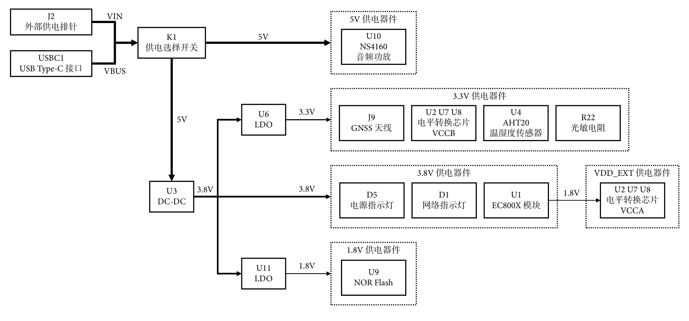

> **注意**
>
> - 为减少图形复杂度，实际产品中搭载的对外供电、接口上下拉等功能未在本图中展示。
> - 受元器件供应等因素影响，实际产品可能并未搭载图中的所有器件。

### USB 接口供电

用户可使用板载的 USB Type-C 接口对开发板进行供电，典型电压 5.0 V。

在使用 USB 接口供电时，请使用质量可靠的 USB Type-C 线缆。质量较差的线缆可能导致供电不足。

若用户希望使用个人电脑的 USB 接口为开发板提供电力，请将开发板连接至电脑端的 USB 3.0 接口。

> **注意**
>
> - 电脑端的 USB 2.0 接口通常无法满足开发板的供电要求，可能导致模块因供电不足而重启，或出现其他异常。
> - 对于台式电脑用户，请尽可能将开发板连接至主机机箱后部的 USB 3.0 接口。
> - 为防止供电不足，请尽可能避免使用 USB Hub（集线器或扩展坞）。若用户因电脑 USB 接口数量不足而必须使用 USB Hub 的，请选择支持外部供电的 Hub 型号，并在将开发板连接到 Hub 之前，预先将 Hub 的外接供电端连接到最大输出功率不低于 10 W 的外部直流电源（如手机充电器）。
> - 若用户无法通过 USB 接口向开发板提供足够的电力，请参考下文使用外部供电排针对开发板进行供电。

### 外部供电排针供电

用户可使用外部直流电源通过板载的外部供电排针对开发板进行供电，供电电压范围 4.5 - 5.5 V。

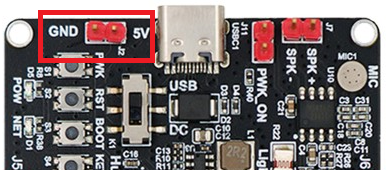

在使用外部供电排针供电时，请使用质量可靠、纹波较小的外部直流电源，并确保外部直流电源的最大输出功率不低于 10 W，否则可能导致模块因供电不足而重启，或出现其他异常。

### 供电选择开关

开发板搭载了一个供电选择开关，用于选择外部供电来源。

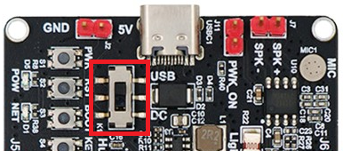

当开关位于 USB 位置时，开发板将从 USB Type-C 接口获取全部供电。

当开关位于 DC 位置时，开发板将从外部供电排针获取全部供电。

> **注意**
>
> 当开关位于 DC 位置时，开发板搭载的 EC800X 模块的 USB_VBUS 引脚处于断开状态，这一特性可能导致 USB 插拔检测等功能无法返回预期结果，用户使用相关功能时应予以注意。

### 模块独立供电

在特定情况下，用户可能希望仅对开发板搭载的 EC800X 模块等核心部件进行供电，而不对开发板上的其他元件，如 DC-DC 转换器进行供电，以尽量降低功耗。此时，可使用开发板排针 J5 的 17 和 18 号针脚对模块进行供电。

> **注意**
>
> 这两个针脚分别与模块的地（GND）和主电源（VBAT，42、43 号引脚）直接相连，未增加任何转换或防护措施，在错误操作的情况下，存在较大的损毁模块的可能性，使用时应尤为小心。

用户可根据各型号模块的《硬件设计手册》了解不同模块的供电范围和注意事项。本文档不作详述。

## USB 接口

EC800X_QuecPython_EVB 提供了一个 USB Type-C 接口，仅支持 USB 从模式。此接口符合 USB 2.0 规范。USB 2.0 支持高速模式，最高速率达 480 Mbps，且向下兼容 12 Mbps 全速模式。

用户通过此接口可将开发板与用户设备相连接。此接口可用于数据传输、AT 命令通信、软件调试及固件升级；也可作为电源接口，为开发板供电。

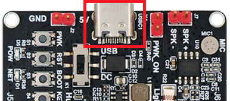

在使用该接口时，请选用带有数据传输功能的、质量可靠的 USB Type-C 线缆。低质量的线缆可能导致开发板功能出现异常。

关于使用 USB 接口为开发板供电的相关信息，在前一章节中已进行介绍，本处不做赘述。

## (U)SIM 卡接口

EC800X_QuecPython_EVB 提供了一个 6 针推入式 (U)SIM 接口。该接口符合 ETSI 和 IMT-2000 规范，支持 1.8 V 和 3.0 V，nano-SIM 尺寸的 (U)SIM 卡。

SIM 卡接口")

模块通过 USIM_DET 引脚实现 (U)SIM 卡的热插拔检测功能，支持高 / 低电平检测（电平触发）。此功能默认未启用，用户可在模块二次开发过程中通过调用函数手动启用热插拔功能。

> **注意**
>
> - 为避免卡片及设备损坏，在手动启用热插拔功能前，请勿在设备处于通电状态下安装或取出 (U)SIM 卡。
> - 安装 (U)SIM 卡将极大地增加模块的功耗水平。当用户使用电脑端的 USB 接口为开发板供电时，为避免供电不足导致的异常，若暂不需要调试网络连接和通信相关功能，建议在上电前取下 (U)SIM 卡。

## 天线接口

EC800X_QuecPython_EVB 提供了三个 IPEX（一代）天线接口，用于连接外部天线，完成不同的通信功能。

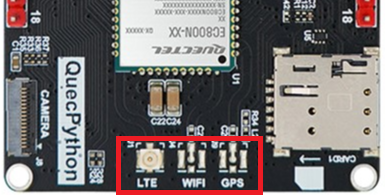

| 类型                | 位号 | 丝印 | 功能                             |
| ------------------- | ---- | ---- | -------------------------------- |
| 主天线接口          | J1   | LTE  | Wi-Fi Scan 与 LTE 通信功能共用   |
| Wi-Fi Scan 天线接口 | J4   | WIFI | 无功能                           |
|                     |
| GNSS 天线接口       | J9   | GPS  | 有源天线接口，仅 EC800MCNGA 适用 |
|                     |

不同型号的模块支持的无线通信频段及所需要的天线种类可能存在差异，请根据实际型号的《硬件设计手册》确认通信频段，选择合适的天线种类并安装到位。

> **注意**
>
> - IPEX 天线安装技巧性要求较高。首次安装时，建议提前查阅相关教程，或寻求经验人士的帮助，避免错误的安装方式导致设备或器件损坏。
> - 请勿在设备处于通电状态下安装或拆卸天线。

## 开关

EC800X_QuecPython_EVB 提供了 1 个供电选择开关。

### 供电选择开关

供电选择开关用于切换开发板的供电来源，在先前章节中已进行介绍，本处不做赘述。

## 按键

EC800X_QuecPython_EVB 提供了 5 个按键，包括 3 个功能按键和 2 个用户自定义按键。

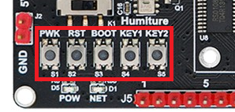

### 开关机按键

开关机按键（PWK）与 EC800X 模块的 7 号引脚（PWRKEY）直接相连。按下该按键后，模块的 7 号引脚将被拉低。用户可通过该按键手动对模块执行开关机操作。

模块在关机状态下，可通过长按开关机按键的方式使模块开机。

模块在开机状态下，长按开关机按键后释放，模块将执行关机流程。

不同型号的模块，开关机所需的长按时间各不相同，如下表所示。

|  模块型号  | PWRKEY 拉低时长 （开机） | PWRKEY 拉低时长 （关机） |
| :--------: | :--------------------------: | :--------------------------: |
| EC800NCNLA |            500 ms            |            650 ms            |
| EC800MCNLA |            700 ms            |            650 ms            |
| EC800MCNGA |            700 ms            |            650 ms            |
| EC800GCNLD |             2 s              |             3 s              |

> **注意**
>
> 如果需要上电自动开机功能且不考虑关机，则可以使用杜邦线或跳线帽短接自动开机排针 J11。短接后，开发板上电时，模块将自动开机。
>
> 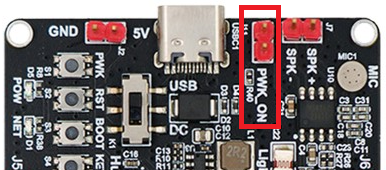
>
> 自动开机排针短接时，通过普通方式（在用户程序中调用关机函数或长按开关机按键）进行关机后，模块会自动重新启动。只能通过强制断开开发板电源的方式进行关机。因此，在开发阶段，不建议启用上电自动开机功能。

### 复位按键

复位按键（RST）与 EC800X 模块的 15 号引脚（RESET_N）直接相连。按下该按键后，模块的 15 号引脚将被拉低。用户可通过该按键手动对模块执行强制复位操作。

不同型号的模块，复位所需的长按时间各不相同。

|  模块型号  | RESET_N 拉低时长 （复位） |
| :--------: | :----------------------------: |
| EC800NCNLA |             300 ms             |
| EC800MCNLA |             300 ms             |
| EC800MCNGA |             300 ms             |
| EC800GCNLD |             100 ms             |

> **注意**
>
> - 建议仅在手动调用关机（或重启）函数和长按开关机按键均无法使得模块正常关机时，再考虑使用强制复位功能。

### 强制下载按键

强制下载按键（BOOT）与 EC800X 模块的 82 号引脚（USB_BOOT）直接相连。按下该按键后，EC800X 模块的 82 号引脚将被拉低。

用户可以在模块开机前，手动按住强制下载按键，模块在开机时将进入紧急下载模式。在此模式下，模块可通过 USB 接口进行固件升级，从而节省升级时间。

### 用户按键

EC800X_QuecPython_EVB 提供了两个用户按键 KEY1 和 KEY2，经由电平转换芯片分别与模块的 19 和 20 号引脚相连。按下按键后，对应的引脚将被拉低。

当用户基于 QuecPython 对模块进行开发时，模块的 19 和 20 号引脚可分别作为 GPIO27 和 GPIO28 被用户使用。

> **注意**
>
> - 模块的 19 和 20 号引脚同时还经电平转换芯片引出到了板载排针 J5 的 11 和 12 号针脚。使用时请注意避免冲突。

## 指示灯

EC800X_QuecPython_EVB 提供了 2 个 LED 指示灯。

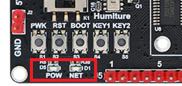

### 电源指示灯

当用户为开发板提供了供电且板载的 DC-DC 器件正常工作时，电源指示灯（POW）将亮起。

> **注意**
>
> 电源指示灯仅代表开发板接入了外部供电，并不能反映模块开机与否，也不意味着当前的供电能够满足开发板正常运行的要求。

### 网络指示灯

网络指示灯（NET）与 EC800X 模块的 16 号引脚（NET_STATUS）相连接。

当模块内运行标准固件（出厂默认固件）时，该指示灯可用于指示网络状态。

|         指示灯工作状态         |   网络状态   |
| :----------------------------: | :----------: |
| 慢闪（200 ms 高 / 1800 ms 低） |   找网状态   |
| 慢闪（1800 ms 高 / 200 ms 低） |   待机状态   |
| 快闪（125 ms 高 / 125 ms 低）  | 数据传输模式 |
|         高电平（常亮）         |    通话中    |

> **注意**
>
> 目前大部分版本的 QuecPython 固件并未启用内置的网络指示功能。因此，当用户为模块烧录 QuecPython 固件后，请避免继续通过该灯判断网络状态。

当用户基于 QuecPython 对模块进行开发时，模块的 16 号引脚可作为 GPIO36 被用户使用。因而用户可手动控制该灯的亮灭。

## 电平转换芯片

EC800X 模块的大部分功能引脚的操作电平为 1.8 V。为便于用户连接外部器件，EC800X_QuecPython_EVB 搭载了电平转换芯片。经由电平转换芯片引出的引脚，操作电平为 3.3 V。

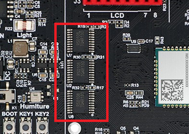

> **注意**
>
> 当电平转换芯片两端没有信号经过时，芯片内部会自动将引脚置于拉高状态，这一特性可能会影响到 GPIO 电平测量等操作。

## IO 排针

EC800X_QuecPython_EVB 通过两排 18-Pin 排针引出了供电、GPIO、I2C、SPI、ADC 等多种接口，用户可利用这些接口连接外部传感器和屏幕等设备。

> **注意**
>
> 搭载不同型号的 EC800X 模块的 EC800X_QuecPython_EVB 开发板，其排针（包括 J5、J6 和 J3）的各个针脚的功能存在差异。用户在使用前应注意甄别。

### 排针 J5

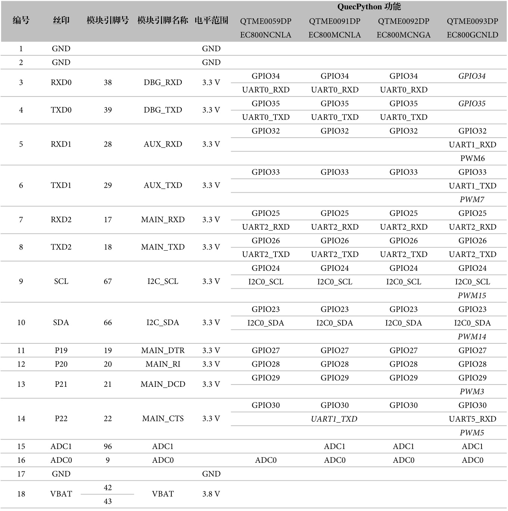

> **注意**
>
> - 表中以 _斜体_ 展示的项目，表示该功能在使用时可能和其他功能存在冲突。在使用前，请查阅 QuecPython 官方文档以了解详情。
> - 受电平转换芯片限制，用户在使用工作电平为 3.3 V 的针脚连接外部设备时，需确保单个针脚通过的电流不超过 50 mA，且所有针脚（包括 J3、J5 和 J6）承载的总电流不超过 100 mA。否则，有损坏器件的可能。
> - 工作电平为 1.8 V 的针脚与 EC800X 模块直接相连。当用户使用这些针脚连接外部设备时，用户需确保单个针脚通过的电流不超过 4 mA。否则，有损坏器件的可能。
> - 不同型号的模块，其 ADC 引脚的电压输入范围各不相同（例如，EC800MCNLA 为 0 - 1.2 V），开发板通过板载的分压电路将其输入范围扩大到原有范围的两倍。输入电压超过该范围可能会导致模块损坏和其他风险。用户在使用 ADC 相关功能时，应提前查阅相应型号的《硬件设计手册》。
> - J5 的 9 号和 10 号针脚在作为 I2C 接口使用时，已经与开发板搭载的 AHT20 温湿度传感器相连接，请注意避免冲突。
> - J5 的 11 和 12 号针脚在电路上与板载的用户按键 S4 和 S5 直接相连，使用时请注意避免冲突。
> - J5 的 13 号针脚在电路上与板载的音频功放 NS4160 的 1 号引脚（CTRL）直接相连，使用时请注意避免冲突。
> - J5 的 16 号针脚与板载的光敏电阻 R22 相连接。不建议使用该针脚直接测量外部电压。
> - J5 的 18 号针脚与 EC800X 模块的主电源直接相连。为避免电压波动导致模块工作异常或损坏，请避免使用 18 号针脚对外部器件进行供电。

### 排针 J6

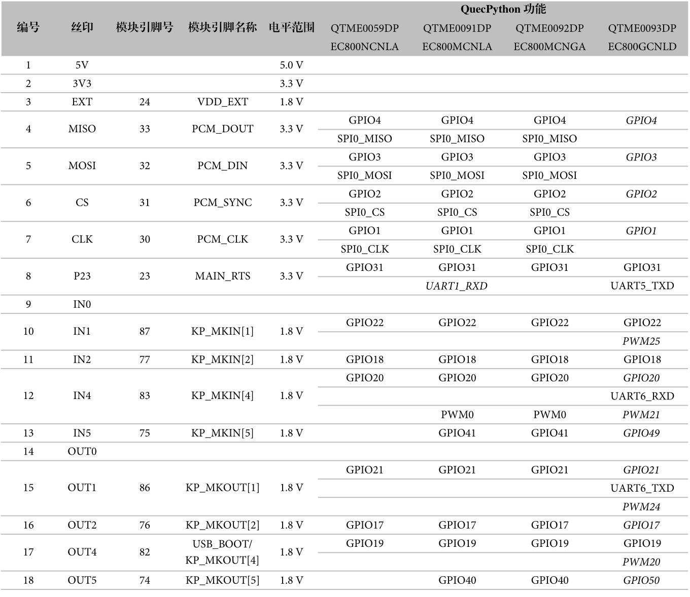

> **注意**
>
> - 表中以 _斜体_ 展示的项目，表示该功能在使用时可能和其他功能存在冲突。在使用前，请查阅 QuecPython 官方文档以了解详情。
> - 受电平转换芯片限制，用户在使用工作电平为 3.3 V 的针脚连接外部设备时，需确保单个针脚通过的电流不超过 50 mA，且所有针脚（包括 J3、J5 和 J6）承载的总电流不超过 100 mA。否则，有损坏器件的可能。
> - 工作电平为 1.8 V 的针脚与 EC800X 模块直接相连。当用户使用这些针脚连接外部设备时，用户需确保单个针脚通过的电流不超过 4 mA。否则，有损坏器件的可能。
> - 在默认情况下，J6 的 9 号和 14 号针脚未与 EC800X 的模块的任何引脚进行连接。
> - J6 的 3 号针脚的最大输出电流为 50 mA，不建议使用该针脚为外部设备进行供电。
> - 请避免在模块开机前将 J6 的 17 号针脚连接至 GND。

## LCD 接口

EC800X_QuecPython_EVB 提供了 1 个 8-Pin 的 LCD 接口。

当用户基于 QuecPython 对模块进行开发时，可使用该接口连接基于 SPI 协议进行通信的 LCD 屏幕。在不连接屏幕时，接口的部分针脚可作为 GPIO 或其他功能使用。

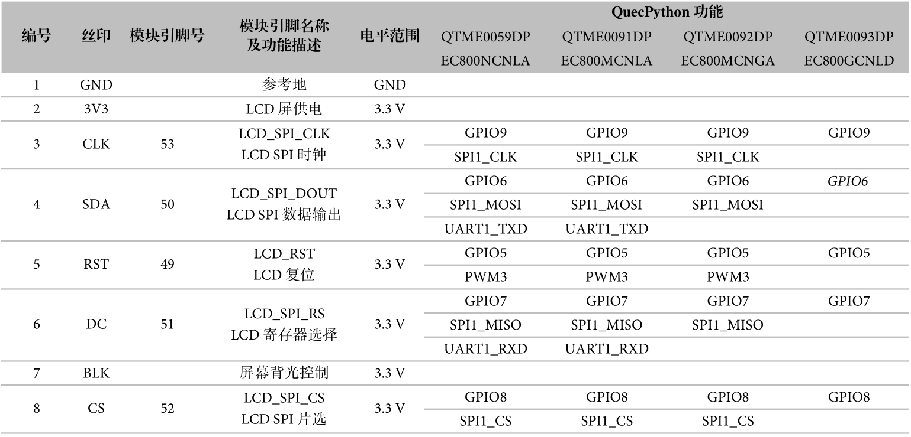

> **注意**
>
> - 表中以 _斜体_ 展示的项目，表示该功能在使用时可能和其他功能存在冲突。在使用前，请查阅 QuecPython 官方文档以了解详情。
> - 受电平转换芯片限制，用户在使用工作电平为 3.3 V 的针脚连接外部设备时，需确保单个针脚通过的电流不超过 50 mA，且所有针脚（包括 J3、J5 和 J6）承载的总电流不超过 100 mA。否则，有损坏器件的可能。
> - 搭载 EC800GCNLD 模块的开发板，在使用 QuecPython 开发时，不支持屏幕显示功能，无法通过该接口连接外部显示屏。

## 摄像头接口

EC800X_QuecPython_EVB 提供了 1 个 16-Pin FPC 摄像头接口，最高支持 30 万像素的摄像头。

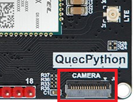

摄像头接口的部分引脚可复用为 GPIO 等功能。在使用摄像头时，请注意避免功能冲突。

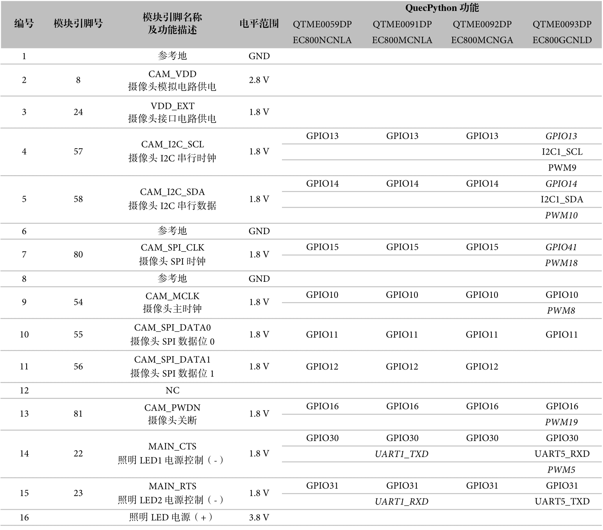

> **注意**
>
> - 当前 QuecPython 仅支持 GC032A 和 BF3901 两个型号的摄像头，且接口线序与市面成品存在差异。请勿随意接入不兼容的摄像头器件。
> - 部分型号的 QuecPython 公开版固件未内置摄像头功能。有商业量产需求的用户请联系官方销售或技术支持人员获取支持摄像头功能的测试版固件，或申请定制固件。
> - 搭载 EC800GCNLD 模块的开发板，在使用 QuecPython 开发时，不支持摄像头功能，无法通过该接口连接外部摄像头器件。

## 音频器件

### 麦克风

板载的麦克风器件与 EC800X 模块的 3 号引脚（MIC_P）和 4 号引脚（MIC_N）相连接，可用于测试 QuecPython 内置的录音功能，亦可用于 VoLTE 语音通话。

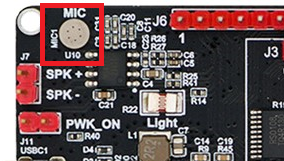

> **注意**
>
> - 麦克风通道对 ESD 较为敏感。EC800X_QuecPython_EVB 在麦克风通道上并未设计 ESD 防护器件，因此不保证当开发板处于恶劣环境或供电质量较差时，麦克风的性能和可用性。
> - 当前出货的各批次 EC800X_QuecPython_EVB 未设计外部麦克风偏置电路。受此因素影响，搭载 EC800MCNGA 模块的开发板可能无法使用麦克风功能。
> - 受模块本身硬件条件限制，搭载 EC800GCNLD 模块的开发板无法使用音频录制功能。

### 外置音频功放和扬声器接口

EC800X 模块本身的模拟音频差分输出通道（通道 0） 5 号引脚（SPK_P）和 6 号引脚（SPK_N）功率较小。在连接 32 Ω 负载时，驱动功率仅为 37 mW 左右。为连接大功率扬声器，EC800X_QuecPython_EVB 板载了 NS4160 音频功放，在连接 2 Ω 负载时，最大驱动功率为 5 W。

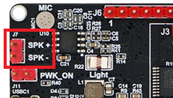

NS4160 芯片的 1 号引脚（CTRL）通过电平转换芯片与 EC800X 模块的 21 号引脚（MAIN_DCD）相连接。当用户基于 QuecPython 对模块进行开发时，可通过 GPIO29 手动控制该引脚的电平高低。当该引脚处于高电平时，放大器正常工作（处于 AB 类模式）；当该引脚处于低电平时，放大器将进入低功耗关断模式。

> **注意**
>
> - 在 EC800X_QuecPython_EVB 开发板上，EC800X 模块的 21 号引脚同时还经电平转换芯片引出到了板载排针 J5 的 13 号针脚。使用时请注意避免冲突。
> - 受模块本身硬件条件限制，搭载 EC800GCNLD 模块的开发板无法使用音频播放功能。

## 外接 Flash

> **注意**
>
> 由于 EC800X_QuecPython_EVB 的后期量产批次均不再焊接板载 Flash 芯片，本文档不再针对这一功能进行介绍。

## 传感器

EC800X_QuecPython_EVB 搭载了一个 AHT20 温湿度传感器和一个 GT36528 光敏电阻，可用于测试 I2C 通信和 ADC 等功能。

### 温湿度传感器

AHT20 是一款测量范围较广、精度较高的通用型温湿度传感器。该传感器经由电平转换芯片，与 EC800X 的 66 号引脚（I2C_SDA）和 67 号引脚（I2C_SCL）相连接，并在电路上进行了上拉处理，可直接进行基于 I2C 协议的通信。

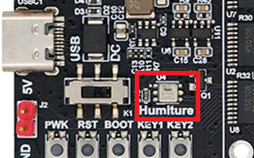

> **注意**
>
> - 关于 AHT20 的具体参数、性能和工作特性，请参考厂商提供的《AHT20 产品规格书》。
> - 关于在 QuecPython 中读取温湿度的操作方法和源码，请参考 QuecPython 官方网站的文档中心。

### 光敏电阻

GT36528 是一款 3.6 x 2.4 mm 封装的光敏电阻。它的暗电阻为 0.5 MΩ，亮电阻为 8 - 20 kΩ。该器件通过分压电路与 EC800X 模块的 9 号引脚（ADC0）相连接。

模块的 ADC0 测得的电压 $V_{\mathrm{ADC0}}$ 与光敏电阻阻值 $R$ 之间的关系为：

$$V_{\mathrm{ADC0}} =  3.3 \mathrm{V} \times \frac{R}{40.2 \mathrm{k} \Omega + R} \times \frac{1}{2}$$

> **注意**
>
> - 光敏电阻的阻值和实际光照度（Lux）并非线性关系，且光敏电阻的阻值和敏感度的个体差异较大，因而不适用于定量测量光照强度。
> - 模块的 9 号引脚同时还经分压电路引出到了板载排针 J5 的 16 号针脚。使用时请注意避免冲突。
> - 关于在 QuecPython 中读取模块内置 ADC 电压的操作方法和源码，请参考 QuecPython 官方网站的文档中心。
