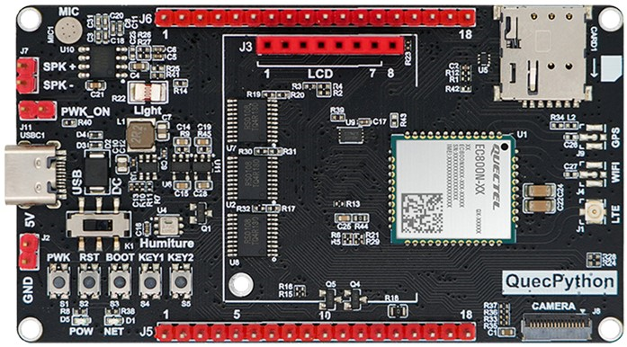
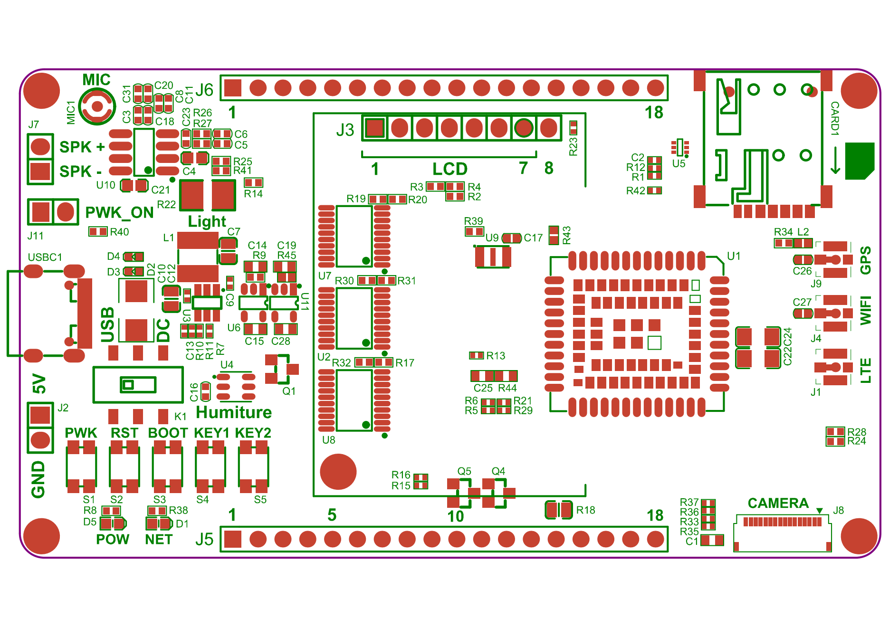

## 产品外观

EC800X_QuecPython_EVB 的外观如下图所示。

## 器件和接口分布

开发板搭载的主要器件的位置及功能如下表所示。用户可结合丝印图进行参考。

### 核心模块

#### LTE Cat.1 模块

开发板采用了兼容设计，支持多种 LTE Cat.1 模块。不同型号的开发板默认搭载的模块型号可能有所不同。

| 开发板 SKU | 模块型号   |
| ---------- | ---------- |
| QTME0059DP | EC800NCNLA |
| QTME0091DP | EC800MCNLA |
| QTME0092DP | EC800MCNGA |
| QTME0093DP | EC800GCNLD |

### 蜂窝通信接口

#### SIM 卡接口

- **(U)SIM 卡接口 (CARD1)**
  - 6 针推入式卡槽
  - 支持 1.8/3.0 V Nano SIM 卡
  - 支持热插拔（需手动启用）

#### 天线接口

- **主天线接口 (J1)**
  - LTE 通信与 Wi-Fi Scan 功能共用此天线接口
- **WiFi Scan 天线接口 (J4)**
  - 当前版本无实际功能，仅为兼容性而保留
- **GNSS 天线接口 (J9)**
  - 仅 EC800MCNGA 型号适用

### 电源管理

#### USB 接口

- **USB Type-C 接口（USBC1）**
  - 支持 USB 2.0 FS / HS 模式
  - 用于数据传输、AT 命令通信、软件调试及固件升级
  - 可用于开发板供电（对端需连接 USB 3.0 接口）

#### 外部供电接口

- **外部供电排针（J2）**
  - 电压范围：4.5 ~ 5.5 V
- **供电选择开关（K1）**
  - 用于切换开发板供电方式
    - USB: 通过 USB Type-C 接口供电
    - DC: 通过外部供电排针供电

### 用户交互

#### 按键

- **开关机按键（S1）**
  - 模块系统开机和关机
- **复位按键（S2）**
  - 模块系统复位
- **强制下载按键（S3）**
  - 控制模块进入下载模式
- **用户按键 1（S4）**
  - 用户自定义功能
- **用户按键 2（S5）**
  - 用户自定义功能

#### 指示灯

- **电源指示灯（D5）**
  - 开发板通电状态指示
  - 不代表模块已开机
- **网络指示灯（D1）**
  - 模块网络状态指示

### 扩展能力

#### IO 扩展

- **IO 排针（J5 / J6）**
  - 18-Pin 排针，2.54 mm 间距
  - 包含供电、串口、I2C、SPI 和 ADC 等接口

### 多媒体

#### 显示

- **LCD 接口（J3）**
  - 8-Pin 排母，2.54 mm 间距
  - 用于连接基于 SPI 协议的 LCD 屏幕
  - 在不连接屏幕时，部分针脚可作为普通 IO 使用

#### 音频

- **音频功放（U10）**
  - NS4160 芯片
  - 最大输出功率 5W
- **扬声器接口（J7）**
  - 最大支持 5W 2Ω 的喇叭
- **麦克风（MIC1）**

#### 摄像头

- **摄像头接口（J8）**
  - 16-Pin FPC 接口，0.3 mm 间距
  - 需配合特定型号和接口线序的摄像头使用

### 其他器件

#### 板载传感器

- **光敏电阻（R22）**
  - GT36528
- **温湿度传感器（U4）**
  - AHT20
  - 基于 I2C 协议进行通信

#### 电平转换芯片

- **电平转换芯片（U2 / U7 / U8）**
  - TXS0108 / RS0108 芯片
  - 用于模块和外部设备间的 1.8 V / 3.3 V 电平双向转换

#### 板载存储

- **NOR Flash（U9）**
  - 未焊接
